# FM Editor

A standalone editor for mods of the PC port: cards and their art, fusions,
equips, rituals, the opponents and their decks and drops, starter decks, the
title screen and the duel's pictures, the campaign map, the game's numbers,
Guardian Stars and card packs. It is a program of its own, not part of the
game. Run from the source it needs nothing but Python 3 and Tkinter (part of
Python on Windows and macOS; on Linux maybe a package of its own:
`python3-tk`, or `tk` on Arch); the release builds bring their own.

**The mod is the diff.** The editor reads the retail tables from your own
game files, lets you change them, and on save writes a mod folder whose
`mod.json` holds only what differs from retail, in the schema the port
reads ([modding](../../../notes/modding.md), [more cards](../../../notes/more-cards.md),
[gameplay tables](../../../notes/gameplay-tables.md)). Opening a mod folder
lays its `mod.json` over retail, so a saved mod can be opened and edited
again. It writes mod folders only: never the disc, never `game/`.

This guide is also `fm-editor-README.md` beside the program, and
**Help > FM Editor guide** opens it [on GitHub](https://github.com/Unchiga/Yu-Gi-Oh-Forbidden-Memories-Recompiled/blob/master/tools/pc/fm_editor/README.md),
where the pictures and links below work.

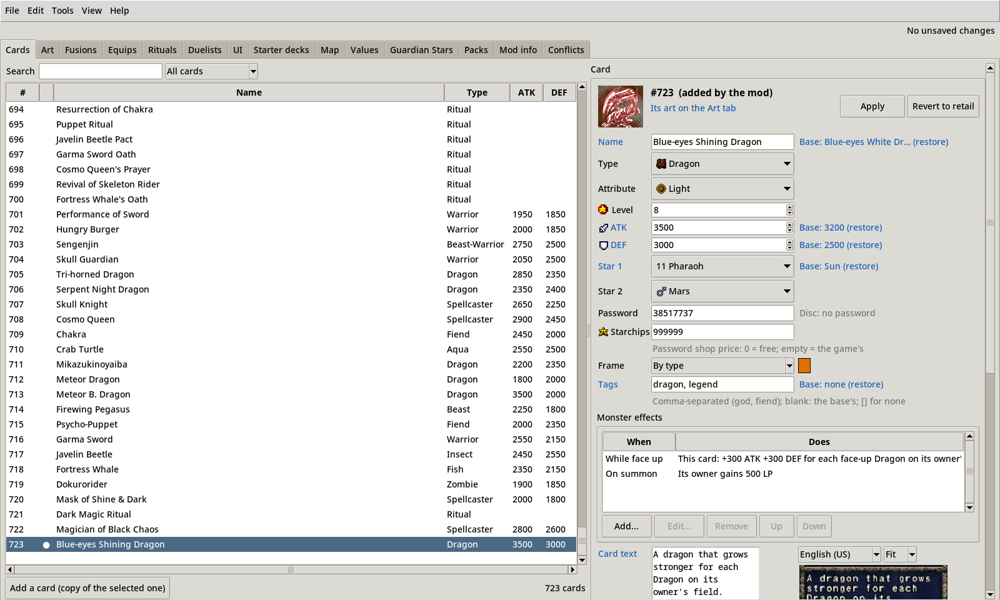

**Contents:** [Getting started](#getting-started) ·
[The window](#the-window) · [The tabs](#the-tabs):
[Cards](#cards), [Art](#art), [Fusions](#fusions), [Equips](#equips),
[Rituals](#rituals), [Duelists](#duelists), [UI](#ui),
[Starter decks](#starter-decks), [Map](#map), [Values](#values),
[Guardian Stars](#guardian-stars), [Packs](#packs), [Mod info](#mod-info),
[Conflicts](#conflicts) · [Card text preview](#card-text-preview) ·
[Troubleshooting and FAQ](#troubleshooting-and-faq) ·
[Game files](#game-files) · [What it writes](#what-it-writes) ·
[Checks](#checks) · [Importing a modified game](#importing-a-modified-game-experimental) ·
[Command line](#command-line) · [Tests](#tests) ·
[Building another front end](#building-another-front-end)

## Getting started

1. **Get the editor.** Each release from
   [Releases](https://github.com/Unchiga/Yu-Gi-Oh-Forbidden-Memories-Recompiled/releases)
   carries it as `fm-editor-<version>-windows.zip` and
   `fm-editor-<version>-linux.tar.gz`. Unpack it where you unpacked the game:
   `fm-editor.exe` (with `fm-editor.pkg` and `fm-editor-files/`, which stay
   together) or `fm-editor` lands beside `memories-pc.exe` or `memories-pc`.
   From the source, run `python tools/pc/fm_editor`
   ([Running it from the source](#running-it-from-the-source)).
2. **Point it at your game.** It looks where the game does (the disc the game
   was last pointed at, `game/` beside it...; [Game files](#game-files)) and
   opens on the Cards tab when it finds one. If not, it opens on a page with
   **Choose the game files...**: choose your USA disc's `.bin`, or a folder
   holding `SLUS_014.11` and `DATA/WA_MRG.MRG`. **File > Game files...**
   changes it later.
3. **Name the mod.** A new mod starts as `my-mod`. On **Mod info**, give it
   an **Id** (letters, digits, `-` and `_`: its folder is named after it),
   a **Name** the game's Mods window shows, a version and an author.
4. **Change things.** Edit on any tab. A form's changes are kept when you
   press **Apply** or leave the tab; the line above the tabs says what is not
   applied or not saved yet. **Ctrl+Z** undoes.
5. **Save it into the game.** **File > Export mod...** and choose the game's
   mods folder: `Documents\My Games\YFM Re-Decomp\mods` on Windows,
   `~/.local/share/YFM Re-Decomp/mods` on Linux (the dialog opens there when
   it exists). The editor makes a folder named after the mod's id in it. From
   then on **File > Save** (Ctrl+S) writes that same folder.
6. **Turn it on.** Start the game, press **F10** for the menu bar, open
   **Game > Mods**, tick the mod and restart the game: the tables are read
   when it starts.
7. **Edit it again** with **File > Open mod folder...** (Ctrl+O). To share
   the mod, zip its folder; others unpack it into their mods folder.

**Tools > Check the mod** (the [Conflicts](#conflicts) tab) lists what the
game would refuse or leave out, and where your mod and the other mods you
have installed change the same thing. Save refuses nothing, but asks first
when the game would refuse part of the mod.

### Running it from the source

    python tools/pc/fm_editor [--game <folder or .bin>] [--mod <mod folder>]

## The window

The window opens at 1600x960 (less on a smaller screen) and every tab fits
it. In Cards, drag the line between the list and the card's form to give
either more room; each scrolls across on its own when it is cut short. On a
smaller window a tab gets scrollbars instead of being cut off; the mouse
wheel scrolls it too, except over lists, text boxes and pictures, which keep
their own scrolling. The Cards tab's form and the Values tab also scroll
vertically on their own: tabbing to a field brings it into view.

The menus:

| Menu | Entries |
|---|---|
| File | **New mod**, **Open mod folder...** (Ctrl+O), **Save** (Ctrl+S), **Save as...**, **Export mod...**, **Recover work...**, **Recovery copy** (how often), **Convert an old recomp's .ygomods package (one way)...** ([below](#converting-an-old-recomps-ygomods-package-one-way)), **Game files...**, **Exit** |
| Edit | **Undo** (Ctrl+Z), **Redo** (Ctrl+Y), **Apply edits**, **Discard form edits** |
| Tools | **Check the mod** (the Conflicts tab), **Preview mod.json** (the file Save would write), **Card text preview** ([below](#card-text-preview)) |
| View | **Dark mode**, **Interface size** |
| Help | this guide and the notes on fusions and values, new cards, starter decks, card packs, added duelists and mods in general (on GitHub), **About** |

Ctrl+F puts the cursor in the tab's search box (Cards, Art, Fusions).

**What differs from retail:** in the Cards form, a field whose value is not
the disc's (a copy's: its base's) has its caption in blue and the disc's
value beside it, **Retail: 3000 (restore)**; a click puts that value back in
the form, and **Apply** stores it. Fields as the disc has them show nothing
beside them. In the lists a changed row is blue, an added one green and one
taken away red (each tab says so under its list). The line above the tabs is
amber for edits not yet applied and blue for changes not yet saved.

**One card across the tabs:** the card selected in Cards is the one Art
shows, and the other way round. Opening Fusions after choosing another card
lists that card's fusions only (the search box holds its number and name;
clear it for every pair; a search of your own is left alone); Equips selects
it when it is an equip card. **Right-click** a card in any list (Cards, Art,
Fusions, Equips, Rituals, Duelists, a fixed deck, Starter decks, Packs) for
**Open in Cards**, **Open in Art**, **Show its fusions**, **Edit its equip
targets** (an equip card) and **Where it's used...**: every fusion, equip,
ritual, duelist deck or drop pool (with its chance), fixed deck, starter
deck, pack (or pack unlock), starter pool and added copy that names the card.
The menu closes on a click elsewhere, another tab or Escape. Double-click a
line to go there; the window lists again each time it comes back to the
front.

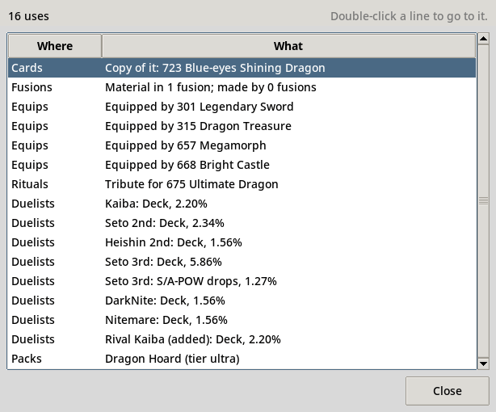

**Sorting:** on **Cards**, **Equips**, and **Duelists**, click a column
heading to sort ascending; click it again to reverse the order. An arrow
marks the active column and direction. Card lists support **#**, **Name** (or
**Card/Monster**), **Type**, **ATK**, and **DEF**; the equip and opponent lists
also sort by their own headings, as do weights, chances and fixed-deck
copies. Numbers sort by value, names and types alphabetically. Each list
keeps its chosen order while filtering, editing, or switching opponents and
pools. Sorting keeps the current selection and changes only the view, so it
does not mark the mod as edited. Wide lists have a horizontal scrollbar.

**Saving:** **File > Save** writes the mod folder (Ctrl+S); the first save
asks where (an empty folder, or a parent where a folder named after the mod
id is made; the port's player mods are in `Documents\My Games\YFM Re-Decomp\mods`).
Enable the mod in the game under **Game > Mods** and restart. **File > Open
mod folder** opens a mod over retail. Save refuses nothing, but lists what
the loader would refuse first. **Save as** copies the mod's assets too,
replacing matching files when overwriting another mod. Its destination may
be inside the source mod; the destination itself is excluded from the copy.
**File > Export mod...** saves the same way, but always into a new folder
named after the mod's id inside the folder you choose (the game's `mods`
folder, say), since the game reads each mod from a folder of its own.

**Apply and Save:** Apply stores a form in the working mod; **Ctrl+S** applies
all valid forms and writes the mod folder. Leaving a tab also applies its form.
An invalid form stays visible with its explanation and keeps your input. The
window title's **\*** and the editing status show unsaved or unapplied changes.
**Edit > Apply edits** applies the forms without saving; **Edit > Discard form
edits** drops unapplied form input while keeping changes already applied.

**Undo and Redo:** **Ctrl+Z**, **Ctrl+Y** (also **Ctrl+Shift+Z**) undo and redo
applied edits across tabs, including card conversions, equip targets, tables,
and imported card/map artwork, pack pictures and Guardian Star icons. Undo first applies a valid pending form, so that
form can be undone too. Invalid input must be corrected or discarded first.
History retains up to 50 edits, with a 64 MiB budget for what older states
hold beyond the mod as it is now (at least the current and previous snapshot);
pictures are shared between snapshots, so a big mod's art costs the history
nothing until a picture is changed. It lasts until a different mod or game is
opened; saving keeps it. Undoing a save changes the working mod: save again to
write that restored version. Dialogs keep their own keyboard behavior.

**Recovery and backups:** While there are unsaved changes, the editor
updates a separate recovery copy of the working mod and its assets every five
minutes, and when **Apply edits** comes more than a minute after the last copy
(or a save fails). **File > Recovery copy** sets how often: **Off**, **Every
minute**, or every 5, 10 or 30 minutes; the choice is remembered. The copy is
written in the background, so editing goes on while a big mod's copy is
made. Unapplied
Cards, Mod info, Values and Packs fields are included, even incomplete input.
This does not save or change the original mod folder. The editor offers to
review leftover drafts on startup; **File > Recover work...** lists drafts and
save backups, with their date and original folder. **Open copy** opens a separate
working copy and its first Save asks for a destination; once that save
succeeds, the crashed session's copy is removed. **Delete copy** removes
an unwanted recovery copy. Before overwriting a saved mod, the editor backs up
the whole folder and keeps its five most recent backups. A failed backup stops
the save, and a failed recovery update preserves the last complete copy and
shows an error. Copies live in a `recovery` folder beside the editor's settings
file; a file unchanged since the previous copy is hard-linked to it rather
than copied again, so a large mod's art takes its space once. A successful save or explicitly discarding a session clears that session's
draft; recovery does not cover edits made in dialogs before their confirmation.

**View > Dark mode** switches the window, its dialogs and the text boxes,
lists and menus to a dark look at once, and back (no restart); the editor
remembers it in its own settings file, `%APPDATA%\FM Editor\settings.json`
on Windows (`~/.config/fm-editor/settings.json`, or under
`XDG_CONFIG_HOME`, elsewhere), never in the mod or the game's folders. Off,
the editor looks as it always has (the desktop's "vista" theme on Windows,
"clam" elsewhere). The dark look is a clam theme recolored (`theme.py`;
text at least 4.5:1 against its background); the Art tab's pictures keep
their pixels. On Windows the title bar turns dark too (Windows 10 1809 and
later), and since Windows draws a menu bar light whatever it is asked, a
strip of menu buttons with the same menus stands in for it (Alt+letter and
F10 open them). Left light: the thin frame Windows draws around an open
menu, and the system's own dialogs (message boxes, choosing a file or
folder).

**View > Interface size** sets how big the editor draws its text, lists and
pictures, on top of the desktop's own scaling (Windows' display scale, or
`Xft.dpi` on Linux). **Fit to window**, the default, grows everything with
the window: the layout is made for 1600x960 at the desktop's scale, and a
bigger window (maximized on a 4K monitor, say) draws it all that much bigger,
up to 3x; the menu shows the size it picked. The fixed sizes (100% to 300%)
keep one size whatever the window, and scroll when it is too small. Ctrl++
and Ctrl+- step through them, Ctrl+0 goes back to Fit to window. A change
applies at once and is remembered beside the dark mode (`zoom.py`).

On Windows the editor tells the system it knows the screen's dpi (per
monitor, `theme.dpi_awareness`, before the first window), so at 125% or
150% it is drawn at that size itself instead of stretched and blurred: the
fonts, in points, follow Tk's scaling, and so do the sizes the editor gives
in pixels (`widgets.px`) and the dark theme's arrows and check boxes. Its
face is Windows 11's Segoe UI Variable where there is one (Segoe UI before),
Consolas for the fixed one. None of this runs elsewhere.

## The tabs

The tabs, left to right:

| Tab | What you edit |
|---|---|
| [Cards](#cards) | a card's name, type, attribute, level, ATK/DEF, stars, password, price, frame, tags, card text, monster effects and notes; magic, trap, ritual and equip cards' effects; adding cards |
| [Art](#art) | a card's picture, thumbnail and name plate |
| [Fusions](#fusions) | every pair and its result; many pairs at once with **Bulk (many pairs)...** |
| [Equips](#equips) | the monsters each equip card fits |
| [Rituals](#rituals) | each ritual's tributes (one to five, from the field, the hand or both) and what it summons |
| [Duelists](#duelists) | the opponents' deck and drop pools, fixed decks, duelists the mod adds and their portraits |
| [UI](#ui) | the title screen, its menus, the duel's pictures and the duel board's textures |
| [Starter decks](#starter-decks) | the decks a new game may deal, written down or drawn from weighted pools |
| [Map](#map) | the campaign map's arrows, camera, marker and pictures |
| [Values](#values) | the game's numbers: LP, the ATK/DEF cap, magic cards' numbers, deck copies, rank score, starchips |
| [Guardian Stars](#guardian-stars) | the stars' names and icons, new stars 11 to 15, every matchup |
| [Packs](#packs) | card packs sold for starchips on the Password screen |
| [Mod info](#mod-info) | the mod's id, name, version, author, description and settings |
| [Conflicts](#conflicts) | what the game would refuse, and where other installed mods change the same things |

### Cards


The list on the left is every card, the mod's own after the disc's 722. The
**Search** box finds a card by number, name, text, notes or tags; the list
beside it shows **All cards**, **Changed**, **Added by the mod**, **With
notes**, **Monsters**, **Non-monsters** or one monster type. A dot between
the number and the name marks a card the mod changes. **Add a card (copy of
the selected one)** makes a new card from the selected one (below).

The form on the right is the selected card, with its picture as the game
draws it (a click, or **Its art on the Art tab**, opens it on the Art tab),
**Apply** and **Revert to retail**. Its fields: **Name**, **Type**,
**Attribute**, **Level**, **ATK**, **DEF**, **Star 1** and **Star 2** (their
lists show the game's icons; the level, ATK and DEF have the game's star,
sword and shield), **Password**, **Starchips**, **Frame**, **Tags**,
**Monster effects**, **Card text** (with the game's 20-letter, 8-line
wrapping counted, and the card view's text box beside it) and **Notes**; the
retail value beside each changed field.

A magic, trap, ritual or equip card has no ATK, DEF, level, attribute or
stars, so the form hides them for one; a magic, trap or ritual card shows
**Retail effect** instead (an equip shows its **ATK boost** and **DEF
boost**): the disc card of the same type it plays as, for you and for the
CPU (`"effect"`, [more cards](../../../notes/more-cards.md)). A monster made
magic starts at **(none)**, which does nothing when played; a disc magic
card has its own effect, and choosing it writes nothing.

**Retail effect** selects a built-in behavior by its original retail name.
The saved number identifies that behavior, independently of the card currently
occupying that slot. For example, giving Blue-Eyes the **Raigeki** effect still
clears the opponent's monsters after the original Raigeki is renamed, given
another effect, or turned into a monster. Any existing card or added copy can
become **Magic**: select the type, choose its retail effect, then apply and save.
An added copy changing kind needs a matching effect; **(none)** is insufficient.
An equip needs none: made an **Equip**, a card shows its ATK and DEF boosts instead.
Numbers appear in the effect list only when retail names are duplicated.

**ATK boost** and **DEF boost**, for an equip card, are what it adds to the
monster's ATK and DEF: the disc's +500 each, or +1000 for Megamorph. Any
whole number from -32767 to 32767 each; empty puts the default back. An
equip has no **Retail effect** to choose: it plays as an equip whatever it
was, and a monster made an equip equips only what you give it in Equips. A
boost set on a disc equip holds for its copies too, unless they set their
own.

Changing a card to **Equip** makes it available in the **Equips** tab after
Apply or switching tabs. **Edit equip targets...** beside its effect applies
the card and opens that equip's target list directly. Add/remove individual
monsters or whole types there; the changes survive saving and reopening.
**Revert to retail** restores the selected effect's default targets.

For **Trap**, the form shows **Retail effect** and hides ATK, DEF, guardian
stars, level and attribute. The six effects that destroy an attacking monster
also show **Trigger at ATK ≤**: the largest current ATK that triggers this
particular card, inclusive (0–65535). Leave it blank for the effect's default,
shown alongside it. Two cards using Bear Trap can have different thresholds.
Goblin Fan, Bad Reaction to Simochi, Reverse Trap and Fake Trap use their retail
triggers and have no ATK threshold field. Changing to one of these effects
clears the previous threshold when applied. Set traps trigger automatically
in a duel; the CPU sets converted and added traps as traps too.

A guardian star may be **(none)**, written `0`: both none is a monster with
no star at all (no SELECT A GUARDIAN STAR box, no star bonus given or taken,
no star drawn), the second none a monster with one star; a first star of
none with a second is warned about, because the game takes the second as the
card's one star ([no star](../../../notes/modding.md#guardian-stars-names-icons-new-stars-and-matchups)).
The star lists show the mod's own stars as the [Guardian Stars](#guardian-stars)
tab names them.

**Password** takes up to 8 digits. **Starchips**, below it, edits the
card's price on the Password screen (0–999999; **0 is free**). The field
shows the price after this mod's `passwords` rules, with the disc's price
beside it. Leave it empty to remove the card's price override and use the
mod's `all` rule, or the disc's price if there is none. Unedited percentage
prices stay as percentages. Added cards use a default price of 999999 and
stable identities in the `passwords` table.

**Frame**: the color of the card's frame (**By type**, or **Monster
(gold)**, **Magic (green)**, **Trap (pink)**, **Ritual (blue)**, **Purple**
or **Orange** whatever its type, or **Type, never orange**), with a swatch
of it; the card view, the Library and the duel draw it
([frame color](../../../notes/more-cards.md#frame-color)). A mod may write
the color (`"Gold"`) or the disc's name (`"Monster"`); the editor reads both
and writes the disc's, which older builds of the game read too.

**Tags**: words a [card layout](../../../notes/modding.md#frame-styles-and-the-rules-that-pick-them)
may give the card a frame of its own by (`"tags"`, [tags](../../../notes/more-cards.md#tags)),
comma-separated (`god, fiend`); blank leaves them out (an added card then has
its base's, said beside the field), `[]` writes none. The search finds them
too, and the checks warn of an empty tag, one over 31 letters, and more than
the 32 different tags the game has room for.

**Notes** (at the bottom of the form): text of your own on the card (what
you changed, what you plan), saved as its `"notes"`; the game shows none of
it, and a code mod can read `<tag: value>` tags from it
([notes on a card](../../../notes/more-cards.md#notes-on-a-card)).
**Revert to retail** keeps them; the **With notes** filter lists the cards
that have some, and the search finds words of them too.

**Add a card** copies the selected card as a new card with a stable id,
named "... II". Its form then has an **Added card** box: its **Stable id**
(what saves and other mods know it by), **Can be won in its base's place**
and **Opponents' decks can deal it in its base's place**, and **Remove this
card**. A new card starts in nobody's chest: it is won in its base's place
(when ticked), dealt in a starter deck or a pack, or given by Game > Cheats;
its password works in the Password shop and is shown in the card view. It
fuses, equips and is a ritual's card as its base until the mod says
otherwise.

#### Monster effects

A monster's **Monster effects** box, below its guardian stars, lists what
it does on the field (`"monster_effects"`, [monster effects](../../../notes/more-cards.md#monster-effects)):
a row per effect, **When** and what it **Does**. **Add...** and **Edit...**
(or a double-click) open the effect: **When** (On summon, On flip, On draw
phase, Before combat, When destroyed, Destroy opponent monster, While face up, each explained under
it: a summon is face up only, a flip is the face-down card attacked), **Does** (a magic card's effect, a boost of ATK and DEF, healing its
owner, damage to the opponent, destroying monsters), and what that needs: the magic card, whose
monsters a boost or destroy reaches (and only of one type or attribute), the ATK and
DEF, the LP. **For each** (off, "—", by default) makes a boost, heal
or damage once per face-up monster on its owner's field, the opponent's or
the whole field, with **Counting type** and **Counting attribute** to count
only those; the list then reads, for example, "This card: +300 ATK +300 DEF
for each face-up Dragon on its owner's field". Only what the game can do for that **When** is offered: while
face up, only boosts; before combat, a boost of the card itself or of the
monster it battles, healing or damage. **Remove**, **Up** and **Down**
change the list; the effects resolve in its order. A change is stored at
once. An added card shows its base's effects until you change them, which
gives it a list of its own. **Force no effects** on a disc card writes an
empty list, which takes away effects an earlier mod gives it. Write what the
effects do in the card text: the game shows only the text. A monster with
effects is drawn with the orange frame while its **Frame** is **By type**
(the swatch shows it); choose **Monster (gold)** to keep it gold, or
**Type, never orange** (`"Type"`) for its type's frame. The checks
(Conflicts) report an effect the game would leave out.

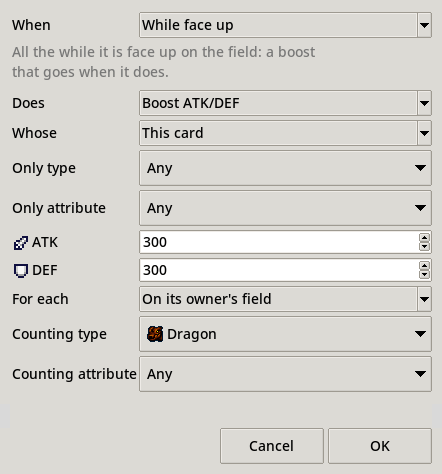

#### Icons and colors in card text

The card text box shows an icon as the icon itself, two letters wide as the
game sets it, and a color as a thin bar of it, the letters after it in that
color (darker on the light look, so they read). Its lines break where the
game's do (twenty letters, an icon two, a word kept whole; a word too long
for the box cut at its edge).

Beside it is the card view's **text box** as the game draws it: its stone and
frame off your disc and the card text in the game's letters and colors,
following what you type. **Fit** (the default) makes it as tall as the card
text box, so the form keeps its height; 1x, 2x and 3x are the game's pixels. Its language list has the port's translations found
beside the editor or the game (`languages/*.txt`): their own layout, type and
star names, accented letters as the port makes them, and the European
letter spacing. The language and size are remembered. On the
retail disc it matches the game's screen pixel for pixel (US, German and
French checked); a letter the port takes from a system font (Greek,
Cyrillic) can be a pixel off, as FreeType's hinting is not copied. What
is saved is still the codes: a code typed or pasted in full becomes its
picture, and copying puts the codes on the clipboard. Without the game files
the codes stay as written.

Right-click the card text box for **Insert icon...** and **Text color**.
**Insert icon...** opens a window of every icon, as the game draws it, by
group (the monster types, the card kinds, the guardian stars, the buttons);
it scrolls when the screen is too short for it. A click puts the icon in at
the cursor as its code (`{f8 0B 00}` the Dragon) and closes it. **Text
color** lists white, yellow, blue, green, grey, orange and red, each with
its color; a color with text selected colors the selection and goes back
to white after it, without one it starts at the cursor. The codes are listed
in [card text codes](../../../notes/more-cards.md#card-text-codes); an icon
takes two letters of the line. **Tools > Card text preview** draws them.

### Art

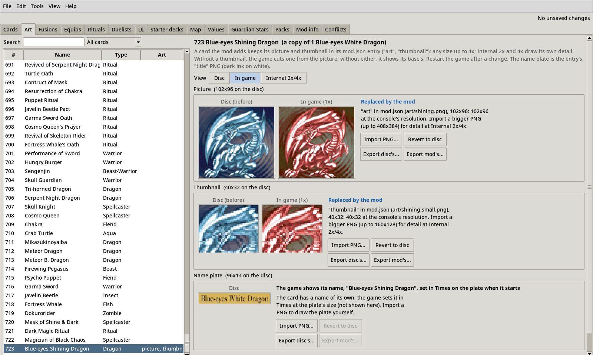

A card's picture (102x96), thumbnail (40x32, the hand and the field) and
name plate (96x14), one picture each in the view chosen at the top: **Disc**,
**In game** (the console's resolution) or **Internal 2x/4x**; a part the mod
changes shows the disc's beside it (before, after). **Import PNG...** (up to
4x, 408x384 and 160x128, for detail at Internal 2x/4x, on retail and added
cards alike; or double-click a picture), **Export disc's...** and **Export
mod's...** (to paint over), **Revert to disc**. The pictures grow to the
room the window gives them, the thumbnail and name plate side by side under
the picture when that makes them bigger. The list's **Art** column says which
parts the mod changes. A card the mod adds with a name of its own has its
name plate set by the game in Times when it starts, unless you import one.
Where the art goes is under [What it writes](#what-it-writes).

### Fusions

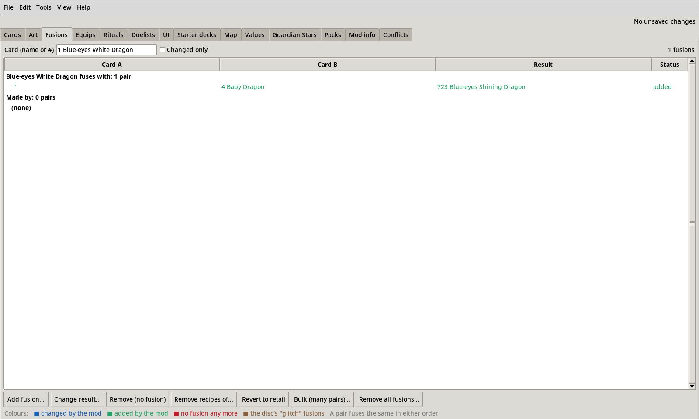

Every pair and its result. **Card (name or #)** shows one card's fusions, in
two groups: the pairs it fuses with and the pairs that make it; empty shows
every pair. **Changed only** shows only what the mod changes. The buttons:

* **Add fusion...**, **Change result...**, **Remove (no fusion)** (the pair
  no longer fuses) and **Revert to retail**, for the selected pairs.
* **Remove recipes of...** takes away every disc recipe of a card in one
  `remove` rule.
* **Bulk (many pairs)...** adds or takes away the fusions of every card of
  one filtered set with every card of another ([below](#bulk-fusions)).
* **Remove all fusions...** leaves none at all (the disc's table goes in one
  `{"remove": "all"}` rule, the mod's own fusion rules are dropped and an
  added card's own recipes blocked), so fusions added after it are the only
  ones; a banner then says so, **Show the removed disc fusions** lists them
  anyway, and the button reads **Restore disc fusions** to bring the disc's
  table back.

A pair a card's own `fusions` list makes (no rule of the mod deciding it
first) shows that list's result, marked "own list". A pair fuses the same in
either order. The 15 "glitch" fusions the game's table reader makes by
reading past an odd record are shown as retail fusions, in brown.

#### Bulk fusions

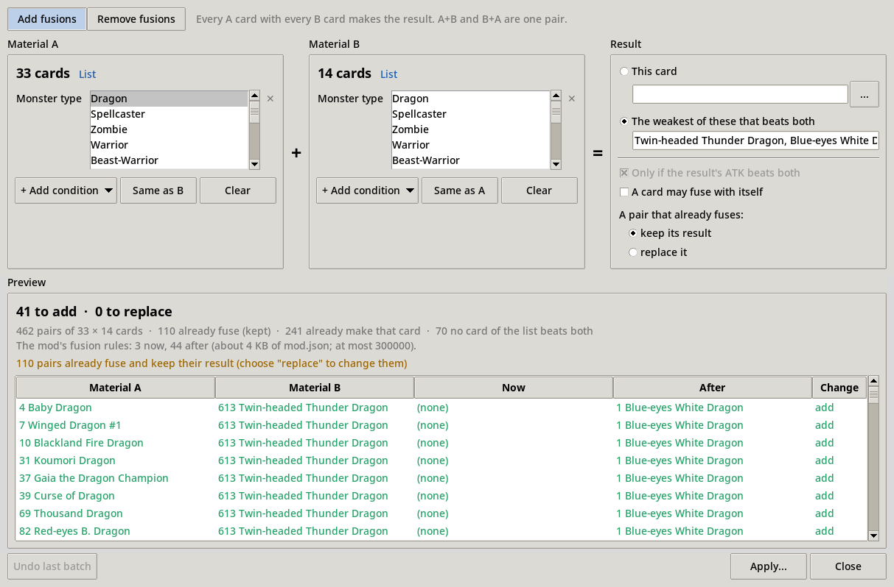

**Bulk (many pairs)...** (`bulk_dialog.py`, the rules in `bulk_fusions.py`)
is an equation: **Material A** + **Material B** = **Result**. **Add
fusions** makes every A card with every B card fuse into the result;
**Remove fusions** makes them stop fusing (only those that make one card,
when one is given).

Each side is any card until **+ Add condition** narrows it: **Kind**
(monster, magic, trap, ritual, equip), **Monster type**, **Attribute**,
**Guardian star** (either of the two), **ATK**, **DEF** and **Level**
ranges, **Name has** and **Text has** (words of the name or of the card text
as the editor shows them, any case), **Cards** (numbers, ranges such as
`10-20`, names) and **Only cards a fusion makes**. A card is chosen when all
of them hold; ✕ takes one away. The side's count heads it, and **List**
shows its cards. **Same as B** (**Same as A**) copies the other side's
conditions, **Clear** empties one.

* **Result**: **This card**, or **The weakest of these that beats both** (a
  list of monsters; each pair gets the one with the least ATK above both
  materials', the way the disc's type fusions climb). **Only if the result's
  ATK beats both** skips the pairs it would not; **A card may fuse with
  itself** lets a card pair with itself.
* **A pair that already fuses**: **keep its result**, or **replace it**.
  What "already fuses" means is the port's reading: the pair's rule, or for a
  card the mod adds, its base's (`Tables_Fusion`); a pair a rule forbids
  (`null`) fuses with nothing and is free. A pair already making the chosen
  card is left alone.
* A+B and B+A are one pair, as in the game: a pair both sets make twice is
  counted once.

The **Preview** says, as the conditions change, how many pairs are added,
replaced, kept or skipped and why, lists the first 300, and counts the
fusion rules the mod would carry. **Apply...** asks first; **Undo last
batch** puts back the pairs the batch changed (not those edited since). The
mod writes rules, not the disc's 64 KB table, so neither that table's size
nor its count byte per card limits a batch: every pair of the 722 cards is
261,003 rules, a 24 MB `mod.json` the port reads in about 3 s. A batch that
would leave the mod past 300,000 rules is refused. Ports built before the
bulk fusions read a long `fusions` list in quadratic time (20,000 rules took
about a minute); use a current build.

### Equips

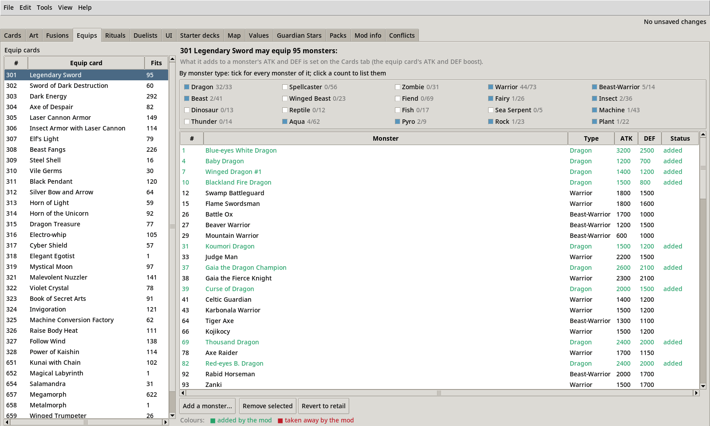

Per equip card (the list on the left, with how many monsters it fits), the
monsters it may equip. **By monster type**: a box a type, ticked when the
equip fits every monster of it and half ticked for some, beside the count
(Warrior 44/73): ticking adds the type, unticking takes it away, and a click
on a count lists that type's monsters alone. **Add a monster...**, **Remove
selected** (or Delete) and **Revert to retail** change the list; monsters
the mod adds are green, those it takes away red. What an equip adds to ATK
and DEF is set on the Cards tab (**ATK boost**, **DEF boost**). A card made
an equip on the Cards tab shows up here once applied.

### Rituals

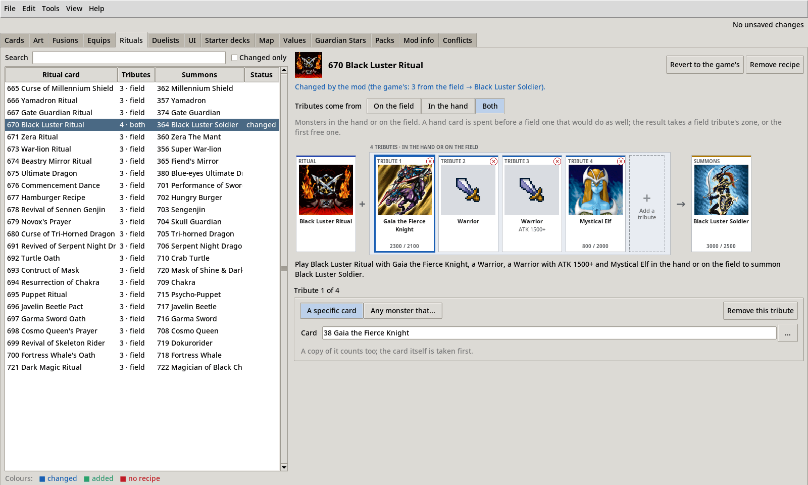

Every ritual card in a list (search, **Changed only**), with its tributes and
what it summons. The chosen one's recipe is drawn as cards in a row, with
their pictures: the ritual card + its tributes → what it summons, and the
same in a sentence. **Tributes come from** **On the field** (the game's),
**In the hand** or **Both** (`"tributes_from"`); one to five tributes
(**Add a tribute**, the × on a tribute). A click on a card edits it below: a
tribute is **A specific card** (a copy counts too) or **Any monster
that...** meets conditions (type, fusion group, ATK, DEF, level, DEF above
ATK); the result a monster. Changes are the mod's at once (Undo takes them
back). **Revert to the game's** puts the disc's recipe back. **Remove
recipe** takes a disc ritual's away, or an added copy's (which otherwise has
its base's), as `"result": null`; **Give it its own recipe** starts a copy's
from its base's ([rituals](../../../notes/gameplay-tables.md#rituals)).

### Duelists

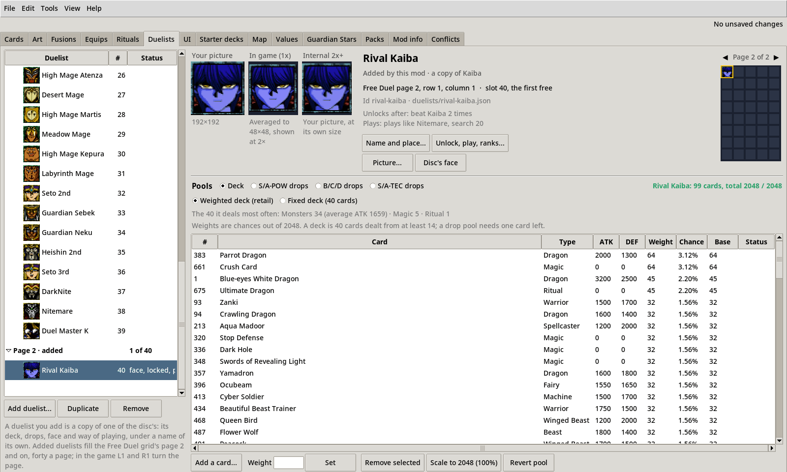

Every opponent of the Free Duel grid, a small portrait beside each name,
grouped by the grid's pages: page 1 the disc's forty, page 2 and on the
duelists the mod adds (**Add duelist...**, **Duplicate**, **Remove**). The
one chosen shows its picture and the two the game draws of it (Internal 1x
and 2x and up), where it sits on its page (a map of the page; a click on a
face goes to that duelist, ◀ ▶ turn the page), **Name and place...** (its
name, id, base and slot), **Unlock, play, ranks...** (when the grid shows
it, how it plays, how a duel against it is scored) and
**Picture...**/**Disc's face** (below). The list's **Status** column says
what a duelist has of its own (`face`, `locked`, `plays`, `ranks`...).

Then, per opponent (the mod's own as well as the disc's), its **Pools**: **Deck**, **S/A-POW drops**, **B/C/D
drops** and **S/A-TEC drops**: each card's weight, its chance, the retail
weight, and the total against 2048 (**Scale to 2048 (100%)** scales a pool
back to 2048 the way the port does). **Add a card...**, **Weight**/**Set**,
**Remove selected** and **Revert pool** edit it. A line says what the pool
deals (a deck pool, the forty it deals most often; a drop pool, the chance
of a monster and its strongest one), beside the disc's once changed.

The deck is either the **Weighted deck (retail)** or a **Fixed deck (40
cards)**: forty specific cards by their copies, counted against 40, each
beside its weighted chance; **Copy the weighted deck's most likely 40**,
**Clear**, **Revert to retail**. An added duelist's deck may be fixed too.

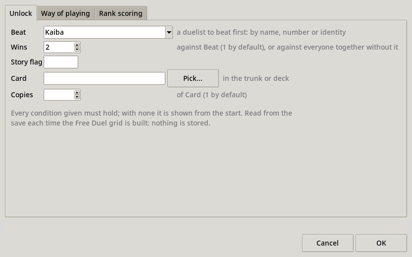

#### Added duelists and portraits

The Free Duel grid shows forty duelists a page. The disc's Deck Build and
thirty-nine are page 1; a mod's own duelists ([more
duelists](../../../notes/more-duelists.md)) fill page 2 and on, and the
game turns the page with L1 and R1. The tab's list is those pages, each
duelist with a small portrait of its face as the grid draws it, and its id
(its place: page 2 starts at 40) beside it.

**Add duelist...** makes a copy of one of the disc's duelists (the one
chosen, or another under **Copy of**): its deck, drops, face and way of
playing, under a **Name** of its own. Its **Id** names its files and is what
a save knows it by; **Place** is the **First free place**, or a **Slot** from 40
to 127 (page = slot / 40 + 1, five cells a row: 45 is page 2, row 2,
column 1), with a line saying where that is and who has it already. It
starts with its base's pools as the mod has them, and they are its own from
then on, edited like any duelist's (the **Base** column is its base's on the
disc, which **Revert pool** goes back to). **Duplicate** makes another with
everything it has; **Remove** takes it out, files and all. **Name and
place...** (or a double-click) changes them later; for one of the disc's it
is the name alone, which is written as a `"replace"` entry taking that
duelist over, as is a new face for one.

**Picture...** gives any duelist a face from a PNG of any size (a
double-click on **Your picture** too), and **Disc's face** takes it away. The
three pictures are the file itself, with the square the game takes from it
marked (the middle one: a wide picture loses its sides), and what the game
draws, worked out as the game does: **In game (1x)** is the 48x48 the grid
shows at View > Internal 1x, and **Internal 2x+** what it shows above that.
A picture bigger than 48x48 is drawn from the file itself: averaged to
48x48 at 1x in the console's colors, at its own resolution above. One of
48x48 or less is made into the console's 64-color portrait and that is
what shows, at any scale.

An added duelist's deck pool and drop pools are edited as a disc duelist's
are, and its deck may be a **Fixed deck** too; they are saved in
`decks/<id>.json` and `drops/<id>.json`.

**Unlock, play, ranks...** edits what the game reads beside these
(`duelist_rules.py`), on three pages:

* **Unlock**: **Beat** (a duelist, the disc's or the mod's own), **Wins**
  (against it, or against everyone without one), **Story flag** (`0x6E0` + n
  is duelist n unlocked in Free Duel; the line beside it says whose), **Card**
  (**Pick...**) and **Copies** of it in the trunk or deck. Every condition
  given must hold; with none it is shown from the start. For one of the
  disc's duelists this stands in place of the campaign flag that shows it.
* **Way of playing** (`ai`): **Play like** another duelist (its row of nine
  numbers), then any of the nine numbers over it, each with the one it
  replaces beside it (deck search 5 to 20, the LP threshold ÷100, the
  low-deck threshold, the two fusion depths, the duster and blind-attack
  percentages); and whether it reads face-down cards (its base's, yes or no).
* **Rank scoring** (`ranks`): the ten rules, each the disc's (unticked,
  shown greyed) or five [threshold, change] pairs of its own, the last
  threshold "above".

What it writes is the shortest form that says the same (`{"search": 12}`
for byte 0 alone), and an entry's own while it still reads the same; a key
of these the game does not read stays as written. The header says what is
set ("Unlocks after: beat Dark Simon 2 times", "Plays: plays like Nitemare,
search 20"), and the Status column `locked`, `plays` and `ranks`. Anything
else an entry carries is kept as written and named there; Conflicts checks
the rest (a beat or card that names nothing here, a search past 5-20, a
rule the game does not have).

### UI

Four pages, picked at the top: **Title screen**, **Menus**, **Duel** and
**Duel board**. The first three are the screen as the game draws it, from
your own disc (the title's pictures are in `DATA/SU.MRG`, the duel's in
`WA_MRG.MRG`; nothing of the game's art is kept with the editor), as big as
the window leaves room for (a whole number of times the game's 320 x 240, so
its pixels stay sharp), with what the mod changes on it. Beside it is the
page's list, grouped, a dot on what the mod changes (in the editor's changed
color); under the list, what the chosen thing is and its form. A picture is
moved by dragging it -- its place in the form follows as you drag -- or by
the arrow keys once the picture has been clicked (Shift: 8 pixels); under
the picture is where the mouse is, in the game's pixels. On the Duel page
the mouse wheel sizes it. What the pages write is the mod's `"title"`,
`"menu"` and `"ui"` ([the title screen](../../../notes/modding.md#the-title-screen),
[the title's menus](../../../notes/modding.md#the-titles-menus), [the duel's
pictures](../../../notes/modding.md#the-duels-pictures)); a PNG you choose is
put in the mod's `ui/` folder.

**Hold: the game's** shows the page as the game has it while the button is
held down: before and after. **Revert to retail...** puts the whole tab back
(it takes out the mod's `"title"`, `"menu"` and `"ui"`, the duel board's
textures and tints, and the PNGs in `ui/` nothing names any more), **Revert
page** one page; both say what is lost first, and **Edit > Undo** brings it
back in one step. A thing's own **Back to the game's** puts that one back. A
color that multiplies (every "Color" but a line of words' and the color
under the background) can only darken; a bright one says so. Settings the
game does not quite follow are noted in the form, only while they are set (a
life-point label with a letter outside plain A-Z, digits and signs shows COM
or YOU instead, and is not drawn over a picture of yours; a life-point half
or the FIELD box moved down over the field, where the cards are drawn over
or under it in the game's order; an "x" or a size a hand-written mod gave
that the game leaves out).

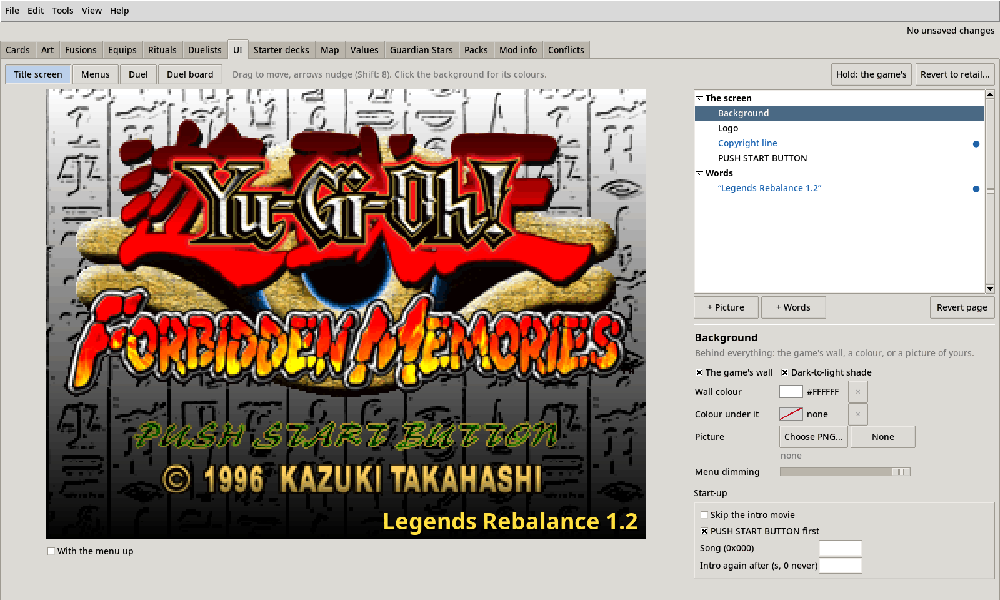

* **Title screen**: the **Background** (click the picture where nothing
  else is, or its row): **The game's wall** or not, its **Wall color**, the
  **Dark-to-light shade**, a **Color under it**, a **Picture** of your own
  over the whole screen, how far a menu dims it (**Menu dimming**); and,
  under **Start-up**, **Skip the intro movie**, **PUSH START BUTTON first**,
  the screen's **Song** and **Intro again after** (seconds idle, 0 never).
  The **Logo**, **Copyright line** and **PUSH START BUTTON**: moved,
  colored, shown always or only with or without a menu, a PNG in their
  place, hidden (a dashed box then, to choose it again). **+ Picture** adds
  a picture of your own (up to eight), **+ Words** a line of words (up to
  sixteen; the port draws these over the picture, in its own letters); each
  has its place (**Centre** puts it in the middle across). **With the menu
  up** shows the screen as the first menu leaves it.

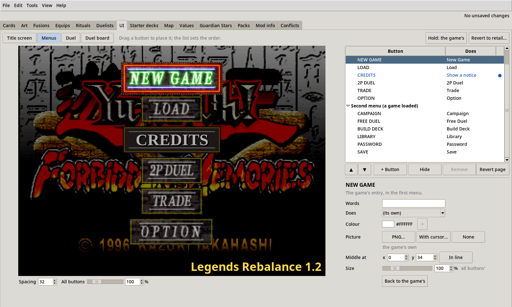

* **Menus**: the first menu and the second (once a game is loaded), each a
  group of its buttons top to bottom, the hidden ones greyed, ▲ ▼ to reorder
  them, **Hide** to leave one out; choosing a button shows its menu.
  **+ Button** adds a button of your own (**Remove** takes it away); each,
  the game's included, has **Words** (drawn on a frame in the entries' look)
  or a **Picture** (**PNG...**, and **With cursor...** for one while the
  cursor is on it), what it **Does** (an entry's choice, back, a notice,
  quit, the debug menu, a code mod's event, nothing; only what that menu
  allows), its **Color** and its place (**Middle at**; **In line** puts it
  back in the column). **Menu background**, the list's first row, is the
  menus' own background, as the title's. **Spacing**, under the picture, is
  how far apart they stand at 100 %. Each button has a **Size**, 25 to 400 %
  about its middle (the slider, or the mouse wheel over it on the picture:
  10 % a notch); **All buttons**, under the picture, sizes every one without
  a size of its own. A bigger button takes more room, so the others stand
  further from it, as the game stands them. The words, the frame and the
  cursor's look grow with it, as the game draws them. A ⚠ under the form
  says when buttons run into each other (the menu squeezed to fit the
  screen, or a place of your own) or one reaches past the screen's edge.

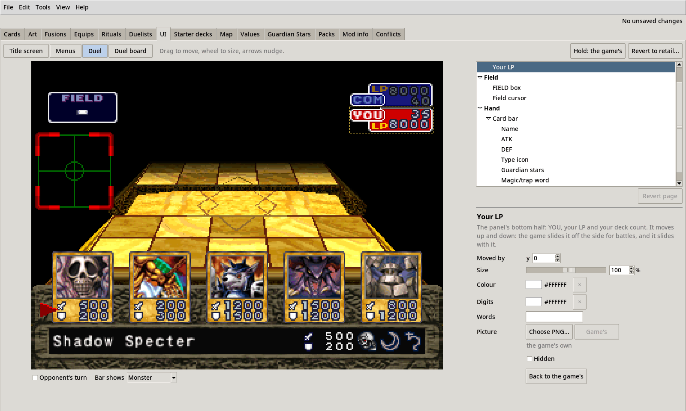

* **Duel**: the life-point panel's two halves (**Opponent's LP**, **Your
  LP**: each with its digits; **Words** in place of COM or YOU, the
  **Digits**' color), the **FIELD box**, the **Field cursor**, the **Card
  bar** (its colors or a picture), its parts (**Name**, **ATK**, **DEF**,
  **Type icon**, **Guardian stars**, **Magic/trap word**: each dragged on
  the bar, colored or hidden, the name's letters spread or drawn together)
  and the **Hand cursor**. Each has a **Color** (multiplied: white leaves it
  as it is), a **Picture** of your own and **Hidden**; the cursors are
  **Moved by** any way and sized 25 to 400 % about their middle. The game
  slides the life-point halves and the FIELD box off the side of the screen
  (for a battle, the duel's end), so they move **up and down only** -- they
  slide with the game's and leave the screen with it -- and are sized no
  larger than still leaves it (161 % for a half, 201 % drawn from your
  picture, 130 % for the box); the pointer over them shows the up-and-down
  arrow, and dragging across does nothing. The **Card bar** itself stays
  where it is, at its size (its parts and the hand are drawn over it): no
  move, no size, the pointer shows it cannot move. **Back to the game's**
  for one, **Revert page** for all. **Opponent's turn** shows the panel in
  the other turn's colors; **Bar shows** a monster or a magic card on the
  bar. Behind them is the duel's screen as it opens, as the game draws it:
  the board (the Duel board page's 3D board from the duel's own camera,
  with the mod's board), the hand's five cards in their frames with ATK and
  DEF, and the card bar's name, stats and icons for the card the cursor is
  on.

Colors are the game's: a tint multiplies, so it can only darken what is
there. The pictures are the console's size here; the game draws a PNG of
yours at up to four times that above the console's resolution.

#### The Duel board page

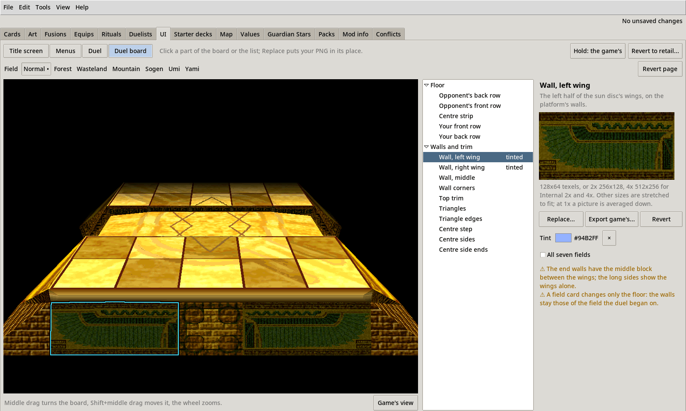

**Duel board** (`ui_board.py`, `board_art.py`) changes the textures of the
duel's 3D board, field by field: **Normal**, **Forest**, **Wasteland**,
**Mountain**, **Sogen**, **Umi**, **Yami** across the top, a dot on those the
mod changes. On the left the board itself: the game's 3D model of it read
from your disc (`board_model.py`), with your disc's textures and the mod's,
lit and seen as the duel's camera sees it at the start of a turn. Drag with
the **middle mouse button** to turn it round (it stays above the floor),
**Shift** (or **Ctrl**) and the middle button to move it, the **wheel** to
come nearer; **Game's view** (or a double middle click) puts the duel's
camera back. Click a part there or in the list to choose it; it is outlined
on the board. A field, a camera or an edit not seen yet shows a smaller
picture of it at once and the full one a moment later, drawn a little at a
time so the window never waits on it; left alone, the page draws the
other fields ahead, so the next one chosen is there at once (the last seven
are kept). While the camera moves, the picture is as small as your machine
draws quickly enough. The list is the field's textures:

* **Floor**: all five rows of zones as one picture, 256x254 texels, far to
  near (the opponent's back row at the top, the centre strip once, your
  back row at the bottom); and each row on its own, 256x52 (the centre
  strip 256x46): five 51x51 tiles side by side. The game draws the centre
  strip twice, the near half turned round.
* **Walls and trim**: the platform's walls (the sun disc's **left** and
  **right wing**, 128x64 each, the **middle** block between them on the
  end walls, and the **corners**), the **top trim**, the
  **triangles** (at the corners and the centre strip's ends) and their
  **edges**, and the raised centre strip's **step**, **sides** and **side
  ends**.

Beside them the chosen texture as the mod has it, its size and:
**Replace...** with a PNG of yours (any size: at the texture's shape it is
used as it is up to 4x, the game drawing it sharp at Internal 2x and 4x and
averaged to the texture's own texels at 1x; another shape is stretched to
fit), **Export game's...** (the disc's texture as a PNG to paint over),
**Revert**, and a **Tint** of the game's own picture (each color of its
palette multiplied: exact at every size; a replaced texture keeps its own
colors, and the tint shows as the palette reads it back, #60FF60 perhaps as
#60FF7F, the same colors). **All seven fields** makes Replace, Tint and
Revert apply to that texture on every field (one PNG for them all).
**Revert page** puts every field's board back. A ⚠ marks what to know about
the texture: the centre strip drawn twice, the wings apart, the trim drawn
in slices, and that a field card (Forest ... Yami) changes the floor only,
the walls staying those of the field the duel began on.

### Starter decks

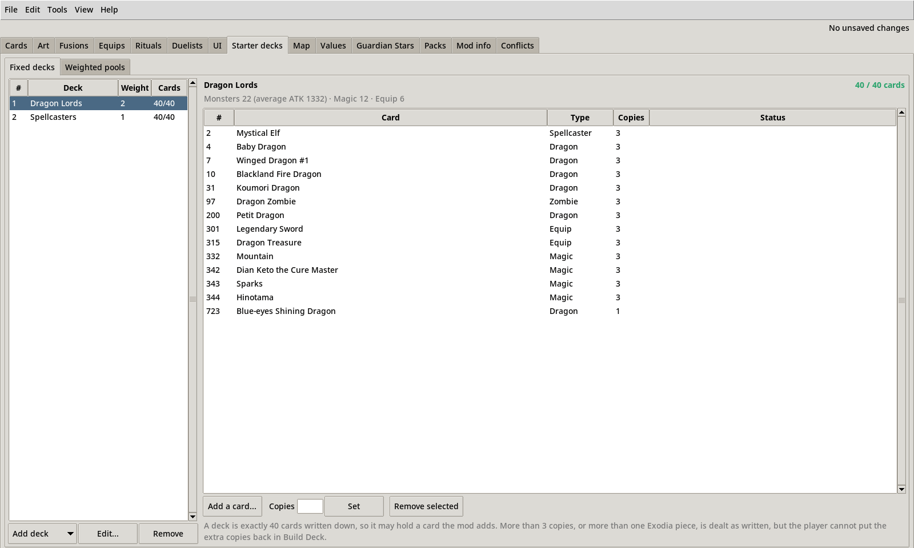

The decks a new game may be dealt in place of the disc's
([the starter deck](../../../notes/starter-deck.md)), on two pages.

**Fixed decks** are written down: a deck's name, its **Weight** against the
other decks offered (**Edit...** changes both), and its cards by their
copies, counted against the forty a deck holds, with a line of what it is
made of (monsters and their average ATK, magic, equips, traps...). **Add
deck**: an **Empty deck**, **An opponent's deck (its most likely 40)...** (the
disc's or one the mod adds: its fixed deck, or the forty its weighted deck
deals most often), **One deal of
the disc's starter pools**, or a copy of the selected one. **Add a
card...**, **Copies**/**Set** and **Remove selected** edit the cards; a deck
may hold a card the mod adds. More than 3 copies, or more than one Exodia
piece, is dealt as written, but the player cannot put the extra copies back
in Build Deck.

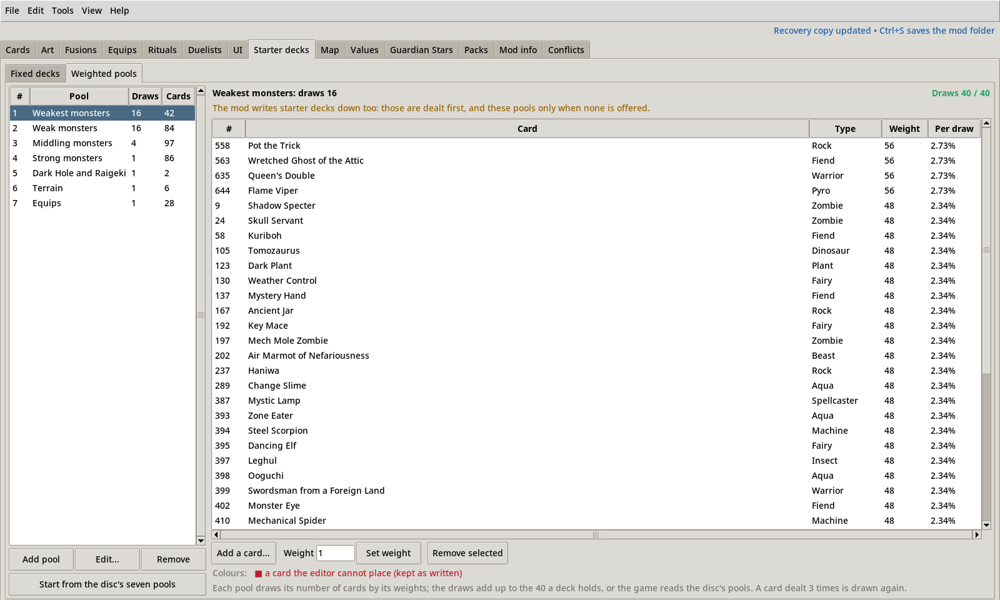

**Weighted pools** (`starter_pools`) draw a different deck each new game:
pools of the mod's own, each drawing its number of cards (**Draws**) by its
cards' weights, the draws counted against forty. **Start from the disc's
seven pools** to change the disc's, or **An empty pool**; **Add pool**,
**Edit...**, **Remove**; **Add a card...**, **Weight**/**Set weight**,
**Remove selected**; **Per draw** is a card's chance in one draw. A card
dealt 3 times is drawn again. Written decks come first: while the mod has
any, the pools are dealt only when none is offered (the page says so).

### Map

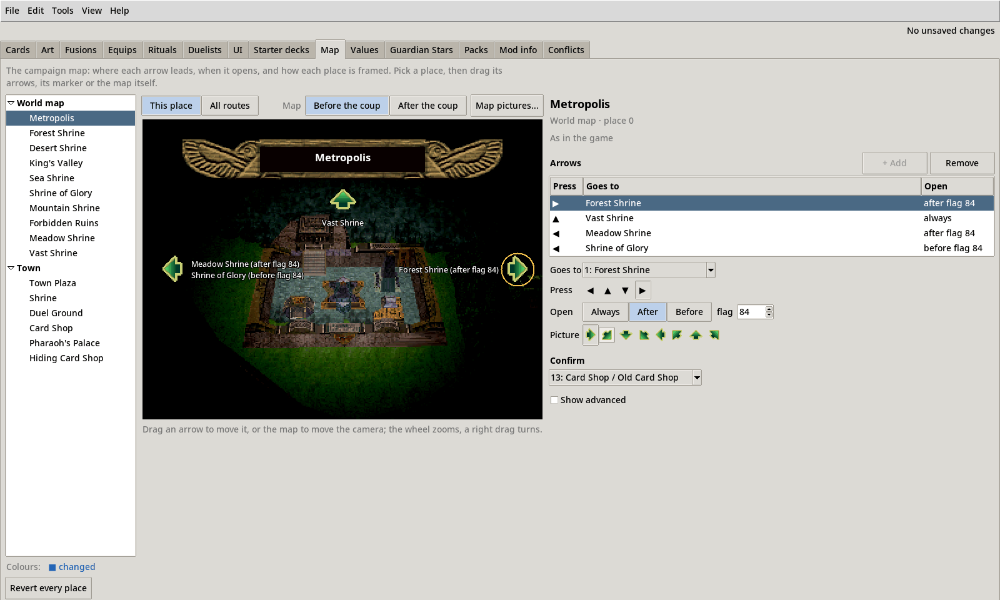

What it changes: how the player gets around the campaign map. At each of
its sixteen places, which arrows show, where each leads, which direction
takes it and when it is open; what Confirm does; how the camera frames the
place; and, in the town, where the Millennium Puzzle marker stands.

The map (`campaign_map.py`) is the overworld module's table of sixteen
places: 0-9 the world map's sites, 10-15 the town's, named as the game
names them (strings `0x8350` + place; two town places read "before /
after" when their label changes once the tournament is over). The list
groups them under **World map** and **Town**, a changed one in the
changed color; **Revert every place** under it puts the whole map back. A
place is edited as the screen the game shows there:

* **This place**: the place's screen, as big as the interface size allows
  (2x, 3x from 150%, 4x from 200%), over the map as its camera sees it
  (drawn from the disc's own 3D map, `map_view.py`: the terrain model, its
  textures, the camera of `ViewState_ApplyOrbit`, the game's fog and, on
  the world map, its spotlight; close to the game's frame, not exact,
  because the light is a fit). The name panel, each arrow (the game's own
  sprite from the map's strip, `field_08`) and, in the town, the marker
  are drawn where the game draws them. Drag an arrow or the marker to move
  it (a click on an arrow picks it); drag the map itself to move the
  camera (the ground under the mouse stays under it), the wheel zooms, a
  right drag (or Shift and drag) turns it. A drag draws the map small as
  it goes and in full once dropped; each is one undo step.
* **All routes**: the world map from straight above (turned as its cameras
  mostly look: -x up) with each world site where its camera looks, the town
  (place 10's camera) with its places where the marker stands, and every
  arrow as a line to where it leads: green always open, amber after a
  flag, blue before it, dashed for Confirm; thicker for the place picked.
  Dragging a world site moves its camera's target; dragging a town place
  moves its marker.
* **Map: Before the coup / After the coup** chooses which of the disc's two
  models the pictures are drawn from (the terrain changes; the table is one
  for both).
* The panel: the place's name, then what differs from the disc, each part
  with its own way back (**↺ Arrow 2**, **↺ Camera**, **↺ Marker**,
  **↺ Confirm**, **↺ All**; "As in the game" otherwise). **Arrows** lists
  the arrows used (the disc's slots with a destination other than 16) by
  the direction pressed, where each goes and when it is open; **+ Add**
  takes the first free slot (a direction no other arrow takes, the arrow
  picture and spot that go with it, a place none leads to yet, 16 frames,
  the disc's usual length), **Remove** sets the slot's destination to 16.
  The arrow picked: **Goes to**, **Press** (any of the four directions),
  **Open**: **Always**, **After** a story flag is set, or **Before** it is
  (the flag the game tests, `0x8000` set in the record for "before"; flag
  `0x47` reads "the coup", the flag that swaps the town's map), and
  **Picture** (the eight arrows the map has). **Confirm**: where Confirm
  leads ("Enter this place" is the disc's 0, the place's own scene).
* **Show advanced**: the numbers behind the drags. The arrow's x, y and
  **Walk frames** (the move's length: the camera and the marker take that
  many frames); under the screen the camera (distance; **Turn** and
  **Tilt**, heading and pitch in 4096ths of a turn; and the x and z it
  looks at); the marker's x, y (the town only: the world map draws none,
  so a world site's are kept as they are); **Confirm only while arrow 1 is
  open** (the record's gate); and **Compare with a screenshot...** (a
  screenshot of the game at this place replaces the drawn map for this
  camera while the editor is open). A number that differs from the disc's
  has its caption in the changed color. Show advanced only shows: what
  the mod writes is the same either way.

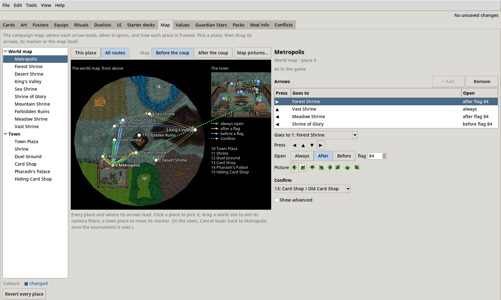

The game takes the first arrow whose direction is held and whose condition
holds, so two may share a direction under opposite conditions (the disc
does that); Cancel in the town, once the tournament is over
(flag `0x47`), always leads back to the world map at Metropolis.

**Map pictures...** (`map_art.py`) replaces the map's own pictures, as
texture pack entries in the mod's pack (the Art tab's pack, `textures/`,
the map's PNGs under `textures/map/`); This place and All routes draw them
at once:

* **Sprites**: the map's one strip of sprites (WA sector `+141` of each
  package, 256x256 at four bits, drawn through four 16-color palettes:
  0 the name panel, 2 the marker, 3 the arrows; a dump shows palette 1
  read too). **Import picture...**
  for one sprite (the marker, the name panel, an arrow) pastes it into every
  cell of that sprite's animation (the marker turns through 16 frames, an
  arrow pulses through 10; the name panel is one frame), so the new picture
  keeps the sprite's motion but not the differences between its frames; an
  arrow and its mirror share their cells (right and left, the diagonals).
  The picture is the sprite's first frame as the preview shows it (the
  marker 32x32, an arrow 16x24, 24x16 or, on a diagonal, 16x16, the panel
  256x32); a bigger one is
  kept at up to 4x. **Export sprites...** writes the strip through each
  palette (`sprites-p0.png` to `p3.png`) to paint every frame yourself, and
  **Import sprites...** takes those files back, any size up to 4x;
  **Revert sprites** puts the disc's back. The mod's entry names the strip
  as the game reads it through one palette, in both packages (the strips
  are the same, and share the PNG).
* **Terrain textures**: the map is a 3D model whose textures are tiles
  (86 in 100 of the texels of its upward faces are drawn more than once,
  one up to 51 times), so there is no single picture of the map to swap:
  its textures are replaced one by one. **Export textures...** writes each
  texture of the chosen map (before or after the coup: two models, 60 and
  61 textures, 4 or 8 bits) as the terrain draws it, one PNG per palette it
  is drawn with (`textureNN-PPPP.png`: the upload's number and the palette
  word), and **Import textures...** takes the files of a folder with those
  names; a texture whose file is not there stays the disc's (**Revert
  textures** puts them all back). A picture of another shape is stretched to
  the texture's, and kept at up to 4x.

At the console's resolution a bigger picture is averaged down to the
texture (the game's 4 or 8 bits are gone: any color goes); Internal 2x
and 4x draw it at its own resolution. The game reads a pack at start, like
the table, so the mod needs a restart.

### Values

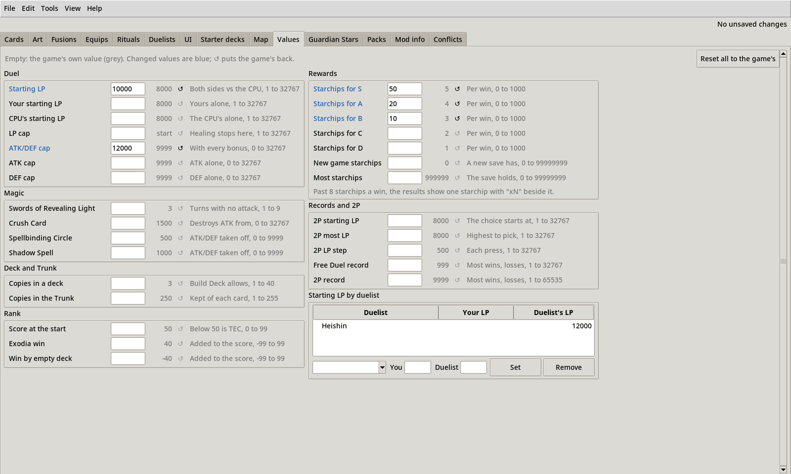

The game's numbers a mod may change (written as `limits`,
[gameplay tables](../../../notes/gameplay-tables.md#values-atk-def-lp-starchips-and-more)),
in groups: **Duel** (starting LP for both sides or each, the LP healing
stops at, the ATK and DEF cap), **Magic** (Swords of Revealing Light's
turns, Crush Card's ATK, what Spellbinding Circle and Shadow Spell take
off), **Deck and Trunk** (copies of a card in a deck, copies the Trunk
keeps), **Rank** (the score a duel starts at, what an Exodia win and a win
by the opponent's empty deck add), **Rewards** (the starchips a win gives at
S to D, 0 to 1000 each: past 8 the results screen shows one starchip with
"xN" beside it; a new game's starchips, the most the save holds) and **Records and
2P** (the two-player LP choice and the records), and **Starting LP by
duelist**: a table of duelists with the LP each side starts with against
them (the disc's, or one the mod adds, by its name; choose a duelist, type **You** and **Duelist**, **Set**; **Remove**).
Each row shows the game's own value in grey (an empty field is it), turns
blue when the mod changes it, has ↺ to put the game's back, and a line that
says what it does with the range the game keeps; a value past that range
turns its name red, with the reason under the groups, and the game holds it
at the most it keeps or shows. **Reset all to the game's** empties every
field.

### Guardian Stars

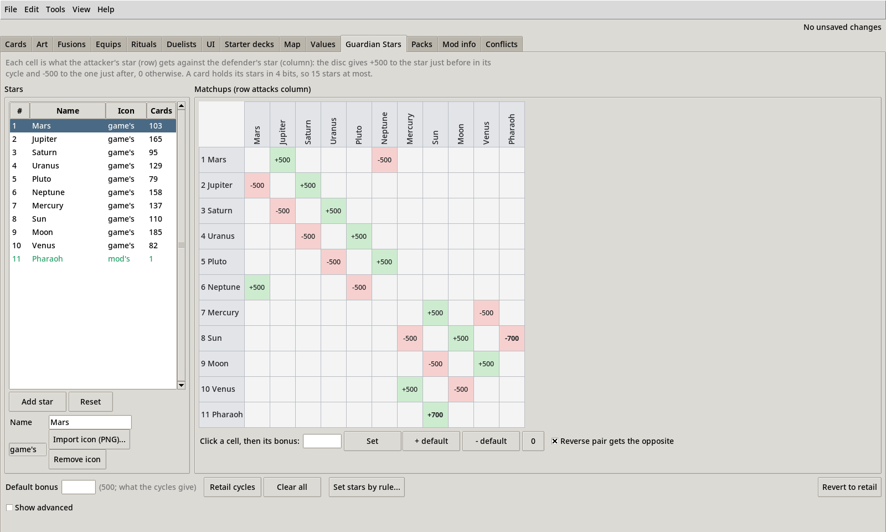

The stars (`guardian_stars`, [Guardian Stars](../../../notes/modding.md#guardian-stars-names-icons-new-stars-and-matchups)):
the list of stars with a name and an icon each (**Import icon (PNG)...**,
with a preview; the game makes it 16x16 in the disc's stars' colors;
**Remove icon**), **Add star** for 11 to 15 (a card holds its stars in 4
bits, so fifteen at most; **Remove** takes an added one away, **Reset** gives
a disc star back its name and icon), and the full grid of **Matchups (row
attacks column)**: a row is the attacker's star, a column the defender's, a
cell the bonus the attacker's side gets, green above 0 and red below; click
a cell, type a bonus and **Set**, or use **+ default**, **- default** or
**0** (with **Reverse pair gets the opposite** on, the reverse cell takes
the opposite sign). **Default bonus** moves the disc's 500 in both cycles,
**Retail cycles** and **Clear all** are presets, **Revert to retail** takes
the whole key away. **Set stars by rule...** sets many cards' first or
second star from their attribute or type through a table you fill in (a
Fire monster's first star is Fire), or one star for all, **(none)** included
(a first star of none leaves the second as the card's one star, as the game
reads it; both none, no star), over a filter of cards like Bulk fusions',
with a preview and **Undo last batch**. **Show advanced**: a name per
language (`fr=Feu, de=Feuer`), an icon's colors (`game` or its own), and
what happens at a summon (`ask`, `first`, `best`). The Cards tab's star
lists show the mod's stars as they are named here.

### Packs

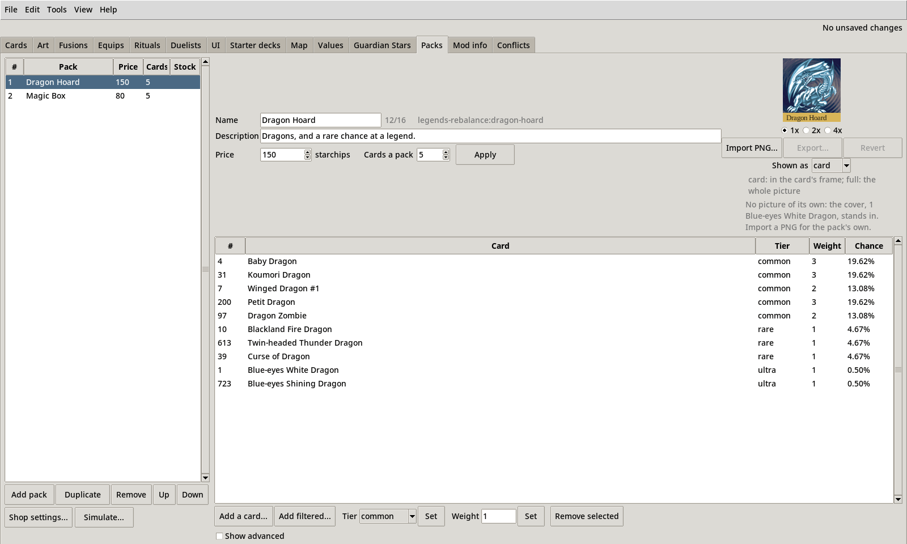

The card packs the mod sells for starchips on the Password screen
([card packs](../../../notes/card-packs.md)). With no pack, the tab offers an
**Empty pack** or **A pack of an opponent's drops...** (its cards at their
drop weights; the opponents the mod adds are listed after the disc's).

The left list is the mod's packs in their order (`#`, name, price, cards a
pack, stock): **Add pack**, **Duplicate**, **Remove**, **Up**/**Down** (the
list's order is the order the game sells them in; `"order"` is written only
when set under Advanced). A pack the game would leave out is red, one with a
note amber; the Conflicts tab has the reader's words (packs.py says what the
game's Mods window would).

The simple view has what most packs need: **Name** (16 letters show; the
identity `mod-id:id` beside it stays when the name changes, since a save's
progress is kept by it), **Description**, **Price** in starchips and **Cards
a pack**. The picture is what the big card on the Password screen shows:
**Import PNG...** (cut to 102:96 from the middle, kept at up to 4x; the
console's resolution makes it 102x96, Internal 2x and 4x draw its own
detail), **Export...**, **Revert** (back to the cover card's art), with the
name plate the game sets in its serif font under it, at 1x, 2x and 4x;
**Shown as** `card` (in the card's frame) or `full` (the whole picture). The
cards: `#`, card, tier, weight and **Chance**, the share of a slot dealt by
the tiers' odds that is this card, before any is taken out. **Add a
card...** (the mod's own cards too), **Add filtered...** (the Bulk fusions
filters: every Dragon under 1500 ATK, say) into the chosen tier at the
weight typed, **Tier**/**Set** moves the selected rows, **Weight**/**Set**,
**Remove selected**.

**Show advanced** (closed at first):

* **Tiers**: name, odds (and their share), label (`"ULTRA RARE!"`), color
  (the game's text colors, 0-15), sound, reveal and how many cards; **Add
  tier**, **Edit...**, **Remove**, **Up**/**Down**: the order is the rarity,
  commonest first. A one-pool pack becomes a pack of tiers with its pool the
  tier `cards`. A renamed tier is renamed in the slots, guarantee and pity.
* **Slots**: every slot by the tiers' odds, or a rule for each: a tier, tiers
  by weight, its own cards (`card=weight`), or always one card.
* **Dealing**: guarantee and pity (`tier=n`), max copies, stock, cost in
  cards (`card=copies` from the chest), order, shops, cover, duplicates
  (`unique_in_pack`), reveal (`flip`, `quick`, `list`), include the cards mods
  add, and **All owned** (`when_nothing_left`): with max copies, when the
  player holds that many of every card, `refuse` the pack (ALL OWNED on the
  screen, nothing paid) or `sell` it anyway, or `(shop's)` for Shop
  settings' rule.
* **Unlock**: beat (a duelist, the disc's or the mod's own), wins, story flag (`0x6E0` + n is the n-th
  campaign duelist beaten), card and copies, starchips spent on packs, packs
  opened, opened (`pack=n`), and whether a locked pack is hidden or shown.
* **Password and sounds**: a password (said when a card has it too: the card
  comes first), once a save, in the list, and the five sound ids (empty for
  the Password screen's own).

**Shop settings...** edits `pack_shop`: what the Password screen sells (both,
packs only, passwords only), the random numbers (`game`, or `save` so a
reloaded save deals the same pack), the music, **All owned** (the rule for
the packs that do not say, `refuse` by default), and the shops, one a line
(`id | name | unlock as JSON`, sixteen at most); a shop's other keys (`where`,
and any the editor has no field for) stay as written. Not yet in the game, and so not offered (the keys
are kept free for them): a PACKS entry in the campaign's shop
(`campaign_shop`), the main menu, saving after each purchase (`autosave`),
selling mods' cards by their passwords (`sell_added_cards`), a currency of the
mod's own (`currency`) and a stock that comes back (`restock`).

**Simulate...** opens N packs (1000 at first) from a seed with the game's own
dealer (`packs.py` is `src/pc/cards/packs.c` in Python: four of the game's
random numbers a card, the guarantee and the pity redealing the last slots,
`unique_in_pack` and `max_copies` shrinking the pools), the pity counted from
one pack to the next as a save counts it, and lists the cards dealt by tier
and by card, how often a tier with a pity came on average and how often the
pity dealt it. The packs are opened a slice at a time, so the editor stays
free meanwhile: a bar shows how far it is and **Stop** shows what came so far
(at most a million packs, and five million cards in all, about a minute).
The tests hold the Python dealer to the C one's deals
(`tests/pc/packs_golden.txt`), line for line.

A field of the pack left as the tab showed it keeps the key as the mod wrote
it: opening a mod and moving through its packs changes nothing of it (a
`"cover": 2` stays a number), and **Apply** writes only the fields changed.
**Duplicate** gives the copy a picture of its own, so importing one for
either pack leaves the other's. When `packs` names a file of the mod, the
tab keeps it as written: a pack's fields and buttons are grey, and only
**Shop settings...** (the manifest's `pack_shop`) is offered.
The file is still inspected for the mod's required API on save. If it cannot
be read, Conflicts reports an error and Mod info says compatibility is
incomplete; fix the file before sharing the mod.

### Mod info

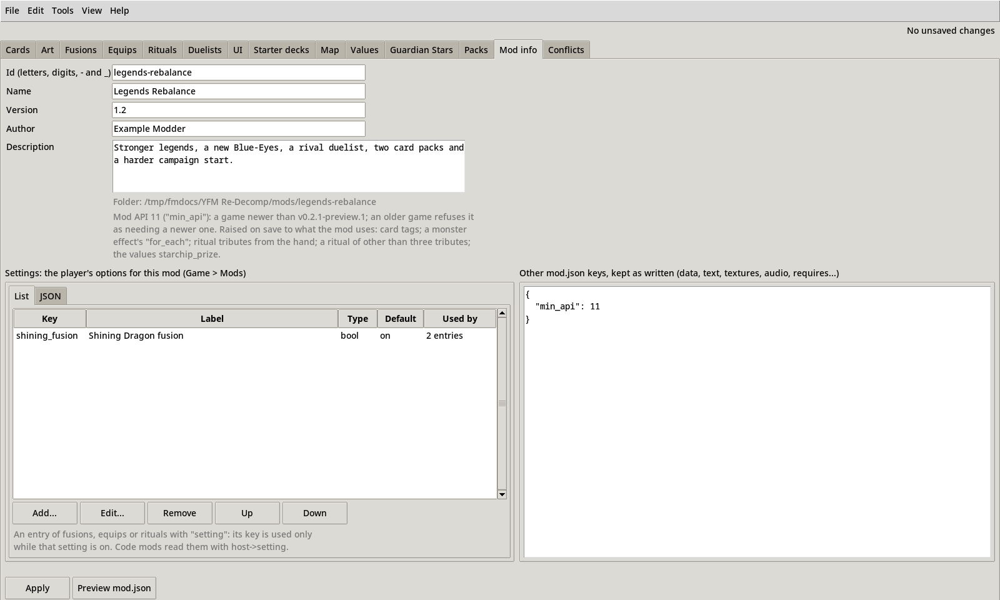

The mod's **Id** (letters, digits, `-` and `_`; its folder is named after
it, and other mods and saves know its cards and duelists by it), **Name**,
**Version**, **Author** and **Description**, as the game's Mods window shows
them, and under them the folder the mod was opened from or saved to, and
the game the mod needs. Saving raises `min_api` to the lowest mod API that
has every feature the mod uses (never lowering a higher one written), so an
older game refuses the mod rather than play half of it; the line says which
game version that is and which features need it (`compat.py`,
[which game a mod needs](../../../notes/modding.md#which-game-a-mod-needs)) The `min_api` it writes shows among the other keys.

**Settings** are the player's options for this mod in the game's
**Game > Mods** window: a list (key, label, type, default, and how many of
the mod's entries each switches with `"setting"`, **Used by**) with **Add...**,
**Edit...**, **Remove**, **Up** and **Down**; the dialog shows what a
setting's type takes and checks it as the game does. Their JSON is a page
beside the list. A fusion, equip or ritual entry with `"setting"` is used
only while that setting is on; code mods read settings with `host->setting`.

**Other mod.json keys, kept as written** (`data`, `text`, `textures`,
`audio`, `requires`...) is the rest of the manifest as JSON, edited as text;
the keys the tabs own (`limits` is the Values tab's, `guardian_stars` the
Guardian Stars tab's, and so on) are refused there. **Apply** stores the
tab, **Preview mod.json** shows the file Save would write.

### Conflicts

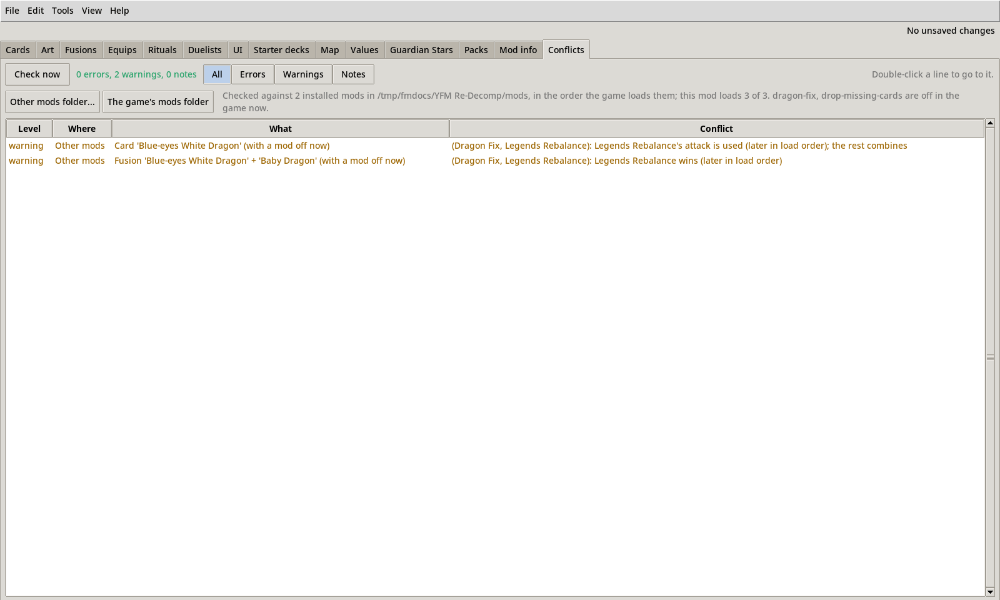

The loader's checks ([Checks](#checks)), all or one level (**All**,
**Errors**, **Warnings**, **Notes**); **Check now** runs them again (the tab
checks when it is opened). Double-click a line (or Return) to go to it, a
line about another mod to the tab and card it is about. Below them, where
this mod meets the **other mods installed** (beside the game and in the
player's mods folder, or a folder chosen with **Other mods folder...**;
**The game's mods folder** goes back): the same lines as the game's Mods
window, a warning where only one mod's change is used and a note where the
changes add up or agree ([When mods overlap](../../../notes/modding.md#when-mods-overlap)).
An error is something the game refuses or leaves out; a warning is played
but probably not what you meant.

## Troubleshooting and FAQ

**I saved the mod but nothing changed in the game.** The game reads mods
when it starts. Check three things: the mod's folder is in a mods folder the
game reads (`Documents\My Games\YFM Re-Decomp\mods`, `~/.local/share/YFM Re-Decomp/mods`,
or `mods/` beside the game; **File > Export mod...** puts it there), it is
ticked in **Game > Mods** (F10 shows the menu bar), and the game was
restarted after the save. The Mods window lists the mod even when it cannot
load it, and says why.

**The game says the mod needs another game or mod API version.** The mod
uses something that build of the game does not know yet. On save the editor
sets the mod's `min_api` from the features it uses, and **Mod info** says
which game version that is and which features need it: update the game to
that release or a newer one (the release the editor came with always reads
what it writes). An older game refuses such a mod rather than play half of it.

**Where is my mod's folder?** **Mod info** shows it under the description.
Before the first save there is none: **File > Save** or **Export mod...**
asks where.

**The editor cannot find the game.** It looks where the game does
([Game files](#game-files)). Choose the game with **Choose the game
files...** on the first page, or **File > Game files...**: your USA disc's
`.bin` (the one the game runs from), an ISO, or a folder holding
`SLUS_014.11` and `DATA/WA_MRG.MRG`. The editor needs the USA disc
(SLUS-01411), as the game does.

**Linux: "No module named tkinter" (running from the source).** Install
Tk for your Python: `python3-tk` on Debian and Ubuntu, `tk` on Arch,
`python3-tkinter` on Fedora. The release's `fm-editor` brings its own.

**Windows: a virus scanner flags `fm-editor.exe`.** The editor is a Python
program packed with PyInstaller, which some scanners distrust. The release
builds it as a folder (`fm-editor.exe`, `fm-editor.pkg`, `fm-editor-files/`)
for that reason; keep the three together. Release builds are checked on
VirusTotal ([releases](../../../notes/pc-release.md)).

**I added a card, but I cannot get it in the game.** A new card starts in
nobody's chest. Tick **Can be won in its base's place** (Cards, the Added
card box), put it in a starter deck or a pack, or give it to yourself with
**Game > Cheats > Give**, outside Build Deck: Build Deck writes its copy of
the chest back when it closes, so a card given while it is open is lost.

**My monster with an effect has an orange frame.** A monster with
**Monster effects** is drawn orange while its **Frame** is **By type**.
Choose **Monster (gold)**, or **Type, never orange** for its type's frame.

**The card text shows codes such as `{f8 0B 04}` in the game.** The game is
older than the codes: update it. The codes are the editor's icons and
colors ([card text codes](../../../notes/more-cards.md#card-text-codes)).

**I changed what a card is (a magic card made a monster, say) and the CPU
misbehaves.** Update the game: builds up to v0.2.0 had the CPU look for
the disc's removal cards by number. The editor's checks (Conflicts) say what
the game would leave out of a card.

**Two cards share a password.** The Password screen gives the lower card
number; the Conflicts tab warns of it. An added card's password is its own,
up to 8 digits.

**A change of another mod wins over mine.** The Conflicts tab lists every
place where your mod and the other installed mods change the same thing and
which one the game uses (the later in load order). Change the order in the
game's Mods window, or leave that part to one mod.

**Fusions I added with Bulk fusions do not show in the list.** The list
shows the card in the search box: clear it to see every pair, or untick
**Changed only**. After **Remove all fusions...** the disc's pairs are hidden
unless **Show the removed disc fusions** is ticked.

**The name plate of my added card is blank under Wine.** The game sets an
added card's name in Times New Roman, which Wine lacks. Windows and Linux
draw it; or import a name plate of your own on the Art tab.

**I lost work.** **File > Recover work...** lists the recovery copies the
editor keeps while you work, and the five backups it makes before each
save over a mod.

**Importing a PS1 ROM hack.** It is experimental and hidden:
[Importing a modified game](#importing-a-modified-game-experimental) says
how to turn it on. Converting an old recomp's `.ygomods` package is always
in the File menu.

## Game files

The editor looks for the game where the port does: `MEMORIES_DISC`, the disc
the port was last pointed at (`disc-path.txt` in the user directory),
`game/` beside the program, the program's folder, `game/` in the user
directory, and `./game`. It takes a raw `.bin` image (the one the port runs
from), an ISO, or a folder holding `SLUS_014.11` and `DATA/WA_MRG.MRG`.

What it reads (layouts in `gamedata.py`):

| Table | Where |
|---|---|
| card stats, level and attribute | `SLUS_014.11`, `0x801D4244` and `0x801D5332` |
| card names and texts | the executable's text banks, through `tools/pc/text_listing.py` |
| equips, fusions, rituals | `WA_MRG.MRG`, the duel package at `0xB63000` (+0x22000, +0x24800, +0x34800) |
| deck and drop pools | `WA_MRG.MRG` `0xE99800 + 0x1800 * opponent` |
| the Password screen's passwords | `WA_MRG.MRG` `0xFB9800 + 8 * card`: price, then the password as BCD digits (`0xFFFFFFFE` for none) |
| the text font and its colors (the card-text preview only) | `WA_MRG.MRG` sector `0x1690` (16 sectors, the 8x12 font's page) and the first 32 bytes of sector `0x16C2`, as `src/pc/cards/font_art.c` reads them |
| the campaign map (the Map tab) | `WA_MRG.MRG`, the two overworld packages at sectors 8153 (before the coup) and 8311 (after): the module's first word `0x14`, the table at `+0x11A8` (16 x 66 bytes), the display resource bank at sector `+140`, the sprite strip `+141` (16 sectors, 256x256 at four bits) and its palettes `+157`; the terrain model at `+6` (134 sectors, an HMD) |

The 15 "glitch" fusions the game's table reader makes by reading past an odd
record are shown as retail fusions and marked.

## What it writes

* `cards`: a `replace` entry per changed retail card with only the changed
  keys, and a `copy` entry per added card with a stable `id`. An added
  card's password is its entry's `password` (8 digits, used in the Password shop and shown by View > Card
  passwords). Keys the editor does not show (`model`, `count`...) are kept as
  written; `art`,
  `thumbnail` and `title` are the Art tab's (below). A copy with no `name` shows its base's name from the disc.
  `stars` is written as the disc's names and `0` for none (`[0, 0]`: no
  star); read back, `0`, `null`, `"none"` and `"(none)"` are all none, as the
  game reads them, and `[none, X]` stays as written.
* `passwords`: a retail card whose password changed gets `{"password": "…"}`
  (`""` for none) under its name, merged into the mod's own entries, whose
  `all` and `"card number"` stay as written. Editing **Starchips** for an original or added card writes
  `"starchips": n` in the card's entry, replacing its previous absolute or
  percentage price; other cards' prices stay as written. A password is up to
  8 digits, and no other card's: the Conflicts tab says when two cards share
  one, since the Password screen then gives the lower card number.
* `fusions`: one rule per pair whose result changed (`"result": null` for a
  fusion taken away). An added card fuses as its base until a rule names it,
  so taking away its pair's fusion writes a `null` rule for it. A mod's
  `{"remove": C}` rules are kept as written, first: the disc recipes of C
  they take away write nothing, and one the mod keeps or changes (reverted
  in the tab, say) is written as a rule of its own, which the remove would
  otherwise take away too. When every disc recipe of C is back, the remove
  is dropped; one for a card no disc recipe makes stays as it was. A
  pair rule the mod wrote is kept even where the result alone needs none
  (the disc's result, or a `null` on a recipe a remove takes away): the
  game asks it before a card's own `fusions` list. So is one for a pair
  such a list names once the modder edits it, so the game plays what the
  tab shows. A remove leaves such a pair to the list, as in the game (mods'
  recipes still make the card): the tab's row says "own list" and shows
  what the list makes (`own_fusion`). Deleting an added card turns a kept
  rule that made it into a null rule, shown as "removed"; one on a pair
  with no disc fusion that no own list names is dropped instead.
* `equips`: per equip card, `add` and `remove` (a whole monster type as its
  name), or `replace` when that is shorter. An added card is equipped (and
  equips) as its base, so what differs for it is written in later entries,
  which the game's reading of the rules confirms before saving. An equip
  card's **ATK boost** and **DEF boost** (Cards tab) are written as an entry
  of its own, `{"card": ..., "bonus": points}`, or `bonus_attack` and
  `bonus_defense` when they differ; `bonus_if` is kept as written, after it.
* `rituals`: a changed recipe, or `"result": null`.
* `guardian_stars`: the stars the mod declares (`id`, and `name`, `icon`,
  `palette` when set), `default_bonus`, `replace` and `choice` when not the
  disc's, and a `matchups` entry for each pair whose bonus differs from what
  the rest of the key already gives; a mod's `beats` and `mirror` are read
  into the grid and written back as those pairs. Icons are written to
  `icons/star-<id>.png` in the mod folder.
* `limits`: what the Values tab sets, a key per field that is not empty
  (`"life_points": 16000` when only both sides' start is set); a key the tab
  does not show is kept as written.
* `drops` and `decks`: per opponent and pool, the fewest listed weights that
  make the port's arithmetic (`tables.c`, mirrored in `pools.py`) come out
  at exactly the edited pool; an edit every opponent shares is written once
  as `"all"`.
* Fixed decks (`"decks": {"Simon Muran": {"fixed": true, "Kuriboh": 4, ...}}`,
  `fixed_decks.py`, read by `tables.c` `read_fixed_deck`): an opponent's deck
  as forty specific cards, in place of its weighted pool, shuffled for each
  duel. A card has 0 to 40 copies (no limit of three: the weighted deal's
  limit does not apply to cards written down), and they add up to exactly 40;
  a card the port cannot name is left out uncounted, so a deck naming one, or
  one that is not 40, is left out and the weighted deck is dealt. The
  Conflicts tab says so before saving, and warns when one duelist has two
  entries (the port deals the later) or weighted edits a fixed deck hides.
  Choosing **Fixed deck** starts from the forty the weighted deck most likely
  deals: its weights apportioned to 40 cards (largest remainder, ties to the
  heavier card and then the lower id), at most three of a card as the retail
  deal allows. Choosing **Weighted deck** again keeps the fixed one aside
  until the mod is closed; **Revert to retail** takes it out and puts the
  weighted deck back to the disc's. The weighted pool's own edits stay in the
  project while a deck is fixed, but a fixed deck written under the same key
  takes their place. A deck the editor read is written back exactly as it
  was while it is untouched (and still names the same cards: a card named by
  an added card's identity follows a new mod id); a changed or new one is
  written as `"fixed": true`, the cards in id order, then any name it could
  not place. An entry for `"all"`, or for another mod's duelist, is kept as
  written. A duelist this mod adds has its fixed deck in `decks/<id>.json`
  (or in mod.json's `decks` under its name or identity, where the mod wrote
  it there), edited the same way. Drops and the other duelist data are not
  touched by any of this.
* `starter`: the decks a new game may be dealt
  ([the starter deck](../../../notes/starter-deck.md)), each written down as
  its cards and their copies rather than as weights — which is what lets one
  hold a card the mod adds. One deck is written as the object itself, several
  as a list. A deck is exactly 40 cards, and the Conflicts tab says so while it
  is not; more than three copies of a card, or more than one Exodia piece, is
  dealt as written but is a warning, because Build Deck will not take it back.
  A card the editor cannot place keeps its row and its copies, under the name
  it was written with, and `"starter"` given as the name of a file stays that
  filename.
* `packs` and `pack_shop`: the card packs and the shop's rules
  ([card packs](../../../notes/card-packs.md)). Each pack is kept as the
  object the mod wrote, so a key the editor has no field for stays as
  written, and is written back with only what differs from the game's
  defaults: no `"count": 5`, `"price": 100`, `"duplicates": "allow"`,
  `"reveal": "flip"`, `"image_style": "card"`..., a pool of weights of 1 as a list, `"cost":
  {"starchips": n}` alone as `"price"`. A pack's picture goes in the mod's
  `packs/` folder. `"packs"` given as the name of a file stays that filename
  (the tab then edits nothing).
* The duelists the mod adds or takes over (`roster.py`,
  [more duelists](../../../notes/more-duelists.md)): each written back where
  it was read — a `duelists/<id>.json` file, mod.json's `"duelists"` list, or
  the file that key names — and one made in the editor as
  `duelists/<id>.json`. An entry holds `copy` (or `replace`), `name`, `slot`
  and `portrait` as the tab has them and every other key as written; one
  that says what it said when read is written as it was. A face is
  `portraits/<id>.png` (or the path its `"portrait"` names). An added
  duelist's pools are its own files, `decks/<id>.json` and
  `drops/<id>.json`, written against its base's disc pools (which the game
  edits for it) and only when they differ; a disc duelist's go in mod.json's
  `decks` and `drops` by its disc name as before, whether or not a
  replacement renames it. `"all"` reaches the added duelists too, as it does
  in the game. A list entry without an `"id"` is given one (a save's record
  of it under its place in the list does not follow). Opening a mod reads
  `decks/` and `drops/` files as the game does, after mod.json's tables; one
  naming a disc duelist moves into mod.json, one holding a disc duelist's
  fixed deck, or naming a duelist neither the disc nor the mod has (another
  mod's), stays the file it was, untouched. An added duelist's
  `"unlock"`, `"ai"` and `"ranks"` are edited (`duelist_rules.py`). The roster's files the editor read are its to
  write: a duelist removed, renamed or back as its base takes its files with
  it on the next save. An entry of `drops` or `decks` naming another mod's
  duelist is kept as written, as is either table given as the name of a file
  (`"decks": "tables/decks.json"`), which the editor does not read.
* `data` (the Map tab): one entry patching `\DATA\WA_MRG.MRG;1` where the
  map differs from the disc, the same bytes in both overworld packages'
  tables (`0xFEC800 + 0x11A8` and `0x103B800 + 0x11A8`, each 1056 bytes),
  as runs of changed bytes (`{"at": "0xFED9CF", "bytes": "01"}`). The PC
  port reads the table from the package it loads
  (`src/overlays/overworld/location_table.c`), as the console does, so the
  patch works on either; the game reads it when the map loads, and data
  mods need a restart. The module's alternate copy of the table
  (`+0x1E54`) has no reader found on the map's paths and is not written. The mod's other
  `data` entries are kept as written, before the map's; opening a mod
  takes its patches of the two tables back into the map (a run across a
  table's edge stays as written, with a note), and a mod whose two tables
  differ opens with the one before the coup and saves both alike.
* The map's pictures (the Map tab's **Map pictures...**, `map_art.py`): texture
  pack entries in the same `textures/manifest.json`, after the Art tab's,
  PNGs under `textures/map/`: the sprite strip as one entry per palette and
  package (`archive` `WA_MRG.MRG`, `offset` the strip's sector `+141`,
  64 words x 256 rows at 4 bits, `clut_offset` the palette in sector
  `+157`), and a terrain texture as one entry per palette it is drawn with
  (the image's place in the model's image section, its words and rows, 4
  or 8 bits, and the palette the polygons name, as the last upload to that
  place in VRAM leaves it). Opening a mod takes such entries back into the
  map; the pack's other entries are kept as written.
* The duel board (the UI tab's **Duel board**, `board_art.py`): texture pack
  entries in the same `textures/manifest.json`, PNGs under
  `textures/board/<field>/` (or `board/all/` for one picture on every
  field). Each field's board is the last phase of its package, 32 sectors
  from WA sector `0x16C6 + 235 * field + 203`, two 64-word columns at 4 bits
  (VRAM 640,256). A texture is one entry per field: its rectangle (`offset`
  the rectangle's first word, `words` and `rows` its size, `stride` 64)
  read through its own palette (`clut_offset`: the floor rows' at
  `+0x7F00 + 0x20 * row` of the phase, the walls' from `+0xF120`), so no
  two entries share a word and each shows at Internal 1x too. A tint is a
  `data` patch of that palette in `\DATA\WA_MRG.MRG;1`, after the map's:
  each color times the tint, the clear color kept, one that becomes black
  written as the opaque black the packs use (`0x8000` with the
  semi-transparency bit, `0x0001` without). Opening a mod takes these
  entries and patches back into the board; a patch of a palette that no
  tint makes stays as written, with a note. With the Forbidden Memories HD
  mod's Duel part on, its board is drawn for some of the floor's rows (its
  entries cover whole columns): switch that part off.
* Art (the Art tab, `art.py`): a retail card's picture and thumbnail go in
  a texture pack, `textures/manifest.json` with PNGs under
  `textures/cards/`, one entry each addressed as `extract_images.py` and
  `hd_assets_pack.py` address them (the picture at the art record, WA
  sector `(n-1)*7 + 722`, 8-bit through its 256-entry palette; the
  thumbnail at sector `n-1`, through its 64 entries), and mod.json gets
  `"textures"`. A pack image may be up to 4x: the console's resolution
  averages it down, Internal 2x and 4x draw its detail. A card the mod
  adds has its base's place on the disc, so a pack cannot tell the two
  apart: its picture and thumbnail are the entry's `art` and `thumbnail`
  PNGs (under `art/`), made into 102x96 and 40x32 at 255 and 63 colors when
  the game starts; a bigger one is drawn at its own resolution at Internal
  2x and 4x (`cards.c`, `add_full_picture`). The name plate of any
  card is the entry's `title` PNG (dark ink on white; a retail card gets a
  `replace` entry for it). An imported PNG is cut to the part's shape from
  the middle (a warning says so), made opaque over black, and kept at most
  4x; a new picture for a retail card makes its thumbnail too, cut where the
  game cuts its own (`tools/pc/hd_recipes/thumb_crops.json`) until one is
  imported. A retail card's own `art` in mod.json would hide the pack's
  picture, so importing one moves it to the pack. An opened mod's pack is
  kept entry by entry: only a card part's plain entry (no `setting`) is
  the editor's. One a setting switches (assets-hd's) is shown until a PNG
  is imported, which goes before it in the pack so the game draws the
  import. A PNG another entry or card shares is left to it, and the PNGs
  are written on save. A card's `art` that can't be read stops the import
  that would move it, instead of losing it.
* Every other key of an opened mod (`data`, `text`, `textures`, `audio`,
  `requires`...) is kept as written, and the folder's other files
  are copied when the mod is saved somewhere new.

Cards are named by their retail name when that finds the card again in the
port (`retail_by_name`), by number otherwise, and added cards by their
stable identity `<mod id>:<id>:1`.

## Importing a modified game (experimental)

> **Experimental.** Importing a PS1 ROM hack is not officially supported
> yet; it is a planned feature. The File menu does not offer it unless the
> editor's settings file (`%APPDATA%\FM Editor\settings.json` on Windows,
> `~/.config/fm-editor/settings.json` elsewhere) has
>
>     "experimental_rom_import": true
>
> (the file is JSON, so add it beside any other keys, e.g.
> `{"dark": true, "experimental_rom_import": true}`), then restart the
> editor. The `import` command is always there. Expect mods it makes to need
> checking in the game; converting a `.ygomods` package (below) is not
> affected.

The PS1 scene's mods (Mod 13, FM 2023, rebalances...) ship patched copies of
the game's files. **File > Import a modified game** (once enabled, above; or
the `import` command) compares a modified `.bin`, or its `SLUS_014.11` and `WA_MRG.MRG`,
with your retail files and makes a port mod of the difference, which then
opens and saves like any other:

| Changed in the modified game | Becomes |
|---|---|
| card stats, names, texts; fusions, equips, rituals; deck and drop pools | `cards`, `fusions`, `equips`, `rituals`, `decks`, `drops`. A name or text that differs only by spaces at line ends stays retail's. Drop pools a mod stores encoded (the TeaOnline drop tool writes `bias + 8 * weight + noise` and makes the draw at `0x80021860` jump to code that undoes it) are decoded as `max(0, (raw - bias) >> shift)`, with the bias and shift read from that code's `addiu` and `sra`, or, when the code is not recognized, the values that make every such pool add up to 2048. Any other pool that does not add up to 2048 is scaled to 2048 keeping each card's share. The report says which |
| other text: dialogue, menus, types, stars, duelists, places | `text.txt`, a partial [text listing](../../../notes/translation.md) (a bank whose changed strings jump is written whole; a bank that is the mod's code is left out and reported). Texts the mod left empty go there too (as a bare `{end}`), and so do card names and texts with color or icon codes (as `{f8 0A 05}...`), as the import finds them; the editor shows them and writes an edited one to `cards[]`, whose `name` and `description` take the codes too. The name entry's strings (`0xF0`-`0xFF`) stay retail's |
| other bytes of `WA_MRG.MRG` (pictures, passwords and costs, portraits...) | `data` patches; a run longer than 4 KB becomes whole sectors in `data/`, replaced at the retail disc's LBA. Past 256 patches or 16 sector runs (the port holds 1024 and 64 for all mods together), or when the file's size differs, the whole file is replaced. The tables `mod.json` carries (fusions, equips, rituals, pools) are always retail's in what `data` carries, and so are starter decks written as counts of 40 and the programs the port runs its own code for (Free Duel, name entry, password, overworld), all reported |
| code and tables of the executable (AI parameters, field bonuses, equip bonuses, the draw...) | nothing, except the rules below: the port runs the executable's code natively. Listed in the report by RAM address, with the `j`/`jal` instructions that reach each place; changed bytes of the text banks that the text listing does not read (a mod's code or tables in the banks' free space, text left over) are listed too |

The report is shown and saved with the mod as `import-report.txt`.

**Mods made with a MIPS patch kit.** A family of mods
changes the duel in MIPS with one kit. `kit.py` recognizes its code by the
place it hooks and the shape of the code, and reads the values from the
mod's own code and tables (the addresses of its code move from mod to mod):

| Signature | Read as |
|---|---|
| `Duel_CheckEquip` steps 94 bytes and tests a bit per monster (A6) | every equip card's monsters from the bitmaps, with the records per monster some add and the monsters no equip takes. Records of monsters or magic used as equips are reported: the port's equips take equip cards only |
| a ritual table that is mostly not recipes (A13) | rituals removed |
| `Duel_ShuffleDeck` deals counts of copies up to 40 (A4) | `decks` with `"fixed": true`: what that shuffle deals from each pool |
| the prize draw jumps to a loop that calls `addiu -bias; sra shift` (A1, A2) | the drop pools decoded; the number of prizes goes to the report and the mod's `README.txt` (set Game > Card drops to it; `mod.json` has no key) |
| `Duel_AwardCard` caps the chest and pays starchips (A3) | `chest_overflow` |
| the terrain table, or `Duel_GetTerrainBoost` reading a table of its own (A9) | `terrain_bonus` with `"replace"` |
| `Duel_SelectAttackTrap` rewritten, thresholds as u16 (A8) | `trap_thresholds` |
| `DuelScene_UpdateCardPlacement` walks a table of bonuses (A7) | `"bonus"` on the equips' entries |

What has no key (the 30000 cap, terrains past six or by attribute, each
opponent's home field, the AI's commands, the frame color, monster effects,
equips with an effect of their own) is listed in the report and in the
imported mod's `README.txt`, in the game's terms.

    python tools/pc/fm_editor import <modified .bin, folder or SLUS_014.11> -o <mod folder>
        [--wa <modified WA_MRG.MRG>] [--game <retail>] [--id <mod id>]

## Converting an old recomp's .ygomods package (one way)

The old static recompilation's in-game editor exported `.ygomods` packages
(a ZIP of INI and text files and PNGs). The port does not read them, and
they are not a mod format of the port: its mods are folders with a
`mod.json`. The editor can only convert one, once, into such a folder, so
that a mod made for the old recomp has a starting point here. The
conversion is best effort: what the port has no key for is left out and
listed in the report, so check the result in the game before sharing it.
**File > Convert an old recomp's .ygomods package (one way)** (or
`import <file>.ygomods -o <mod folder>`) reads one over retail:

| In the package | Becomes |
|---|---|
| `cards/<id>/card.ini`: name, description (`\|` breaks a line), ATK/DEF, level, type, attribute, stars | `cards` replace entries |
| `cards/<id>/card.ini`: `equips`, `ritual` | `equips` (the complete list), `rituals` |
| `cards/<id>/card.ini`: `price`, `password` | a `data` patch of the password table in `WA_MRG.MRG` (`price` taken as the starchip cost) |
| `cards/<id>/art.png`, `thumb.png`, `title.png` | the card's `art`, `thumbnail`, `title` |
| `fusion-edits.txt` | `fusions` (a `clear` line removes every retail fusion first) |
| `drop_table_edits.ini`, `drop_missing_cards.ini` | `drops` (the listed weights, the rest sharing the remainder, as the port does) |
| `cpu-duelists.ini` deck weights; `name =` | `decks` (the whole pool); a renamed opponent in `text.txt` |
| `duelists/<n>/portrait.png` | a texture pack image of the Free Duel portrait |

Listed in the report and left out, as the port has no data key for them:
scripted monster and magic effects (`on_flip`, `battle`, `effect`...),
card and name colors, the nine AI bytes, scripted rewards and StarChip
rules, the recomp's card shop and its settings, and `dialogue.txt`, whose
code numbering is the recomp's own (translate with `text_listing.py`).
The importer was written from the packages' own file layout; no code of the
recomp is used.

## Checks

Before saving, the editor runs the loader's checks (`validate.py`): the mod
id, settings, ATK/DEF in tens up to 5110, levels, a copy staying on its
base's side, equip and ritual cards of the right type, a deck pool of at
least 14 cards, a drop pool with a card left, pools adding up to 2048, and a
fixed deck of exactly 40 cards the editor can name.
For the art, the texture pack loader's (`texture_pack.c`): `textures` inside
the mod and its `manifest.json` an array; each entry's `file` and `archive`,
the file inside the pack and there, its measures (offset, words 1-1024,
rows 1-512, depth 4/8/16, stride, `crop_left` and `width` within the row),
`row_offsets` as long as `rows`, and a `setting` the mod declares; and the
cards' `art`, `thumbnail` and `title`: inside the mod, there, and PNGs.
For the map: a destination past 15 (16 is none) or Confirm past 15,
and a move of 0 frames (the game divides by it) are errors; an arrow (an
exit of the table) that leads back to its own place, needs no direction or
other buttons, is shadowed by an earlier arrow in the same direction under
the same condition, has a flag past `0x7FF` or is off the screen, a marker
off the screen, and a place no arrow, Confirm or Cancel leads to any more
are warnings.
For the duel board: a picture that is not a PNG is an error; one not in its
texture's shape (the game stretches it), one with see-through pixels (the
board shows black there), and a texture both replaced and tinted (the tint
shows nowhere) are warnings.

## Card text preview

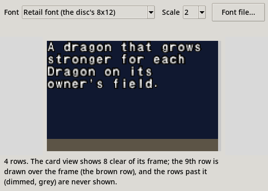

**Tools > Card text preview** opens a window of its own that follows the
Cards tab: the selected card's text as the card view lays it out and draws
it, redrawn as you type. The tab itself is unchanged, and nothing of it goes
into the mod. `card_text.py` does the work:

* **Layout**, in the two steps the port and the game take: the port's
  wrapping (`cards.c` `encode_description`: lines of up to 20 letters,
  broken at spaces, `
` where it stands, a longer word left whole), then the
  text box (`TextBox_WrapLineIfNeeded`): 8 pixels a glyph and 21 to the
  box, so a word past 21 letters is cut where the box ends, and the rest of
  its line takes a row of its own. The card view shows 8 rows clear of its
  panel's frame, draws a 9th over the frame, and stops before a 10th (seen
  in the game with a test text, in Build Deck's card view, whose box has
  255 glyph sprites; the duel's viewer has 160, so a long text may stop
  sooner there). The preview marks each: the 9th row on the
  frame's color, the rows the game never shows dimmed on grey, a red tick
  right of a row the box cut mid-word, and a red box for a character with
  no retail letter (the port sets those from a font); an accented letter is
  drawn plain (the port draws its mark on).
* **Font**, at 1x to 4x:
  * *Retail font*: the game's own 8x12 font and text colors, read off the
    player's disc each time (nothing of it is kept or saved), each texel
    made `scale` pixels square. At 1x the letters are the game's pixel for
    pixel (the panel behind them is a flat color, not the game's stone).
  * *HD text: the port's face*: what Video > HD text draws at Internal 2x-4x,
    set in the face the port uses when no mod gives one (on Windows the
    first of Segoe UI, Arial and Tahoma in the Fonts folder; elsewhere
    fontconfig's `sans-serif:bold`). A mod's own `"font"` comes first in
    the game; choose that file in the next mode to see it.
  * *HD text: a font file*: any TrueType file you have (**Font file...**,
    which opens in the system's fonts folder), such as your own copy of Matrix,
    the face of the paper cards' names, if you have a licence for it. The file is only read: the
    editor never copies it into the mod. OpenType fonts with PostScript
    (CFF) outlines, most `.otf` files, are refused with a message; their
    `.ttf` version works.

  HD text is drawn as `src/pc/text/hd_text.c` sets it: each glyph stays in
  its retail cell, the face's baseline, x-height, capitals, ascenders and
  descenders are set onto the retail font's lines, the glyph is made as
  wide as the cell's letter (so a small-caps face's l stays as narrow as the
  retail l), its stems as heavy, with the dark outline and each row's
  shading through the text's palette. `ttf.py` reads the TrueType outlines
  and fills them in plain Python (non-zero winding, 4 sub-rows a pixel),
  in place of FreeType, so the result is close to the game's, not identical:
  against the game's own 4x picture about half the text's pixels are the
  same color and 96-97% within one or two steps of the palette. A face
  whose lines cannot be measured (no x-height, no descenders) is not used by
  the port, which keeps the retail letters; the preview says so and does too.

  The first HD picture of a face at a scale takes a second or so (the
  window shows a busy cursor); glyphs are kept, so typing redraws at once.

## Command line

    python tools/pc/fm_editor --version

prints the editor version, source commit and supported mod API. **Help > About**
shows the same information. Packaged builds keep the identity recorded at build
time, including whether the source checkout had changes.

    python tools/pc/fm_editor check <mod folder> [--game <folder or .bin>] [--print]

opens a mod over retail, lists what the loader would complain about, and
with `--print` shows the `mod.json` the editor would write for it.

## A standalone executable

    python -m pip install pyinstaller
    python tools/pc/fm_editor/build_exe.py [--dist tmp/pc/fm-editor]

builds the editor with no Python needed to run it. On Windows that is
`tmp/pc/fm-editor/fm-editor/`: `fm-editor.exe`, `fm-editor.pkg` and the
`fm-editor-files/` folder, which stay together. Elsewhere it is one file,
`tmp/pc/fm-editor/fm-editor`. Put them beside `memories-pc.exe` and the
editor finds the game's `game/` folder there. Build outputs never go in git.
Windows gets no one-file build because virus scanners took it for a dropper.

Each release carries it as `fm-editor-<version>-windows.zip` and
`fm-editor-<version>-linux.tar.gz` (`.github/workflows/pc-release.yml`):
unpack it where the game's archive was unpacked, and `fm-editor.exe` with
its files (or `fm-editor`) lands beside the game's program. The Linux one is built on
Debian 11, like the game, and brings its own Python and Tk. Running it from
the source as above works too.


## Tests

Release archives are extracted and launched with
`python tools/pc/test_editor_package.py <archive> --version <release>`
(on Linux, prefix it with `xvfb-run -a -s "-screen 0 1600x1000x24"`).
This runs the packaged editor's `self-test --output <report.json>`: synthetic
game files, every tab and UI page, a card and art edit, export and reopen.
It requires a working display and fails on Tk callback errors; it needs no ROM.
Windows writes its result to JSON because the windowed executable has no console.
Both release platforms run this before uploading their archives; Linux's normal
CI runs the editor suite with Xvfb so GUI tests execute too.

These checks verify the editor and its packaging. The live-game checks below
remain necessary for gameplay and rendering; passing a packaging check does not
verify every mod combination or replace testing the release on supported systems.

    python -m unittest discover -s tools/pc/fm_editor/tests -t tools/pc

(one file: add `-p test_gui.py`). CTest runs each file as a case of its own,
`pc_fm_editor_gui` for `test_gui.py` and so on (`ctest -R ^pc_fm_editor_`),
one at a time, as most open windows. The tests build synthetic game files at the retail
offsets (`tests/fixtures.py`), art records included, and their PNGs in code
(`tests/map_fixture.py` adds the two overworld packages: a made-up table,
resource bank, strip and a one-quad HMD);
they need no game data (the bulk fusion tests time a 722 x 722 preview). PNGs are
read and written by `pngio.py`, in plain Python like the rest; the card-text
preview's tests build their font page and a TrueType file in code as well
(`tests/test_card_text.py`).

With a built game and your disc in `game/`, these checks save editor mods
into isolated folders and play real duels (no changes to your saves or mods):

    python3 tests/pc/card_types_runtime.py
    python3 tests/pc/magic_effects_runtime.py
    python3 tests/pc/trap_effects_runtime.py
    python3 tests/pc/replacement_trap_combat_runtime.py
    python3 tests/pc/trap_effects_runtime.py --hard-mode
    python3 tests/pc/editor_mods_runtime.py
    python3 tests/pc/editor_mods_runtime.py --hard-mode
    python3 tests/pc/editor_round_trip_runtime.py
    xvfb-run -a python3 tests/pc/editor_duelists_runtime.py
    python3 tests/pc/ritual_tributes_runtime.py --editor --interpreter
    xvfb-run -a python3 tests/pc/editor_values_runtime.py
    xvfb-run -a python3 tests/pc/editor_ui_runtime.py [--baseline <a build before>]
    xvfb-run -a python3 tests/pc/editor_board_runtime.py [--out DIR]
    xvfb-run -a -s "-screen 0 1600x1000x24" python3 tests/pc/editor_menu_runtime.py [--baseline <a build before>]

`editor_ui_runtime.py` makes a title, menus and duel pictures through the UI
tab, then plays them: the title and menu with and without the mod, an added
button pressed, a whole duel (a fusion, a magic card, battles, the
opponent's turns, the results) with the moved panel and its digits checked
in each picture, the same at Internal 2x in a window and with the duel
effects interpreted, and, given `--baseline`, the frames without the mod
against another build's.
`tools/pc/bench_board.py` times the board's and the map's renders and every
use of the Duel board page (`--slow N`: as on a machine N times slower; run
it under `taskset -c 0` for one core). `tests/test_render_speed.py` holds
the plain rasterizer the renders replaced and checks them against it pixel
for pixel.
`editor_board_runtime.py` makes a duel board through the Duel board page
(floors replaced at 4x and 1x, one tinted, the walls' wings, trim and
corner triangles on every field) and plays it at Internal 1x and 2x with
and without the mod: duels begun on Normal, Forest and Wasteland, the
camera's sweep round the board, Forest and Wasteland played mid-duel, a
duel to its end, the effect bank still native, and the frames with the mod
off as with no mods at all; each picture is checked by its colors.
`editor_menu_runtime.py` sizes the menus' buttons through the Menus page
(the game's entries, words and pictures, bigger and smaller, All buttons)
and plays them at Internal 1x and 2x, 4:3 and widescreen: the cursor on
every item of both menus, each item measured where the game drew it
against the page's preview, the cursor's look about each one's middle;
resized buttons pressed; and, given `--baseline`, the frames without the
mod against another build's.

`ritual_tributes_runtime.py` plays rituals of one to five tributes from the
field, the hand and both, by the player and the CPU, natively and with the
duel effects interpreted (its docstring lists every check). The
`editor_round_trip_runtime.py` run makes a mod through every tab's own buttons and dialogs (cards,
art, fusions, equips, rituals, duelists, starter decks, values, Guardian
Stars, packs, the map, a setting), exports it, and starts a new game into
a duel on it: the game must read each part and note nothing against it.
`editor_values_runtime.py` types every new value into the Values tab and
plays the mod and the game without it: a duel to its end and results (LP,
Crush Card, Spellbinding Circle, Shadow Spell, the Swords' turns, the rank
score and the starchip prize), an Exodia and an empty-deck win, Build
Deck's copies and a new game's starchips, with pictures of each.
The others cover every monster type, converted equips and rituals, all 33 retail
magic effects, trap thresholds and special triggers, and CPU spell decisions
and outcomes compared with retail after saving and reopening the mod. Pass
`--out <folder>` to retain their logs. The AI adapter's native regression
test is also registered with CTest as `pc_ai_hard_mode_adapter`.

## Building another front end

The window is one front end over an engine that has no Tk in it. Another
front end (Qt, a web page, a script) reuses the engine as it is and replaces
only the window; it does not rewrite the engine, whose rules are the port's
(`tables.c`, `cards.c`, the loaders) and are pinned by the tests below.

**The engine** (no `tkinter` import; plain Python 3, nothing to install):

| Module | What it does |
|---|---|
| `disc.py` | finds and reads the game files (`load`, `find_game`, `user_dir`) into `GameFiles(slus, wa, source)` |
| `gamedata.py` | the retail tables from them: `load_game(files)` → `GameData`; the names of types, attributes, stars, duelists, pools |
| `model.py` | `Project`: the retail tables with the edits on top, and the edits themselves (below) |
| `manifest.py` | reading a mod folder (`open_mod`, `apply`) and writing one (`build`, `dumps`, `save_mod`) |
| `validate.py` | the loader's checks: `validate(project)` → `Issue` list |
| `pools.py`, `fixed_decks.py`, `bulk_fusions.py` | the port's pool arithmetic, fixed decks, bulk fusions |
| `roster.py`, `portrait.py` | the duelists a mod adds or takes over (reading and writing their files, their places on the grid, checks), and Free Duel portraits: the disc's, and the one the game makes of a PNG |
| `duelist_rules.py` | a duelist's `unlock`, `ai` and `ranks`: read as `duelists.c` reads them, written back in the shortest form, checked; how a manifest names a duelist (`reference`) |
| `art.py`, `campaign_map.py`, `map_art.py`, `map_view.py` | card art, the campaign map's table and pictures, the map drawn from the disc's 3D model (`map_view.py` has no Tk despite its name) |
| `board_art.py`, `board_model.py` | the duel board's textures: where each is on the disc, a mod's replacements (pack entries) and tints (palette patches); the board drawn from the disc's 3D model with them (no Tk) |
| `guardian_stars.py`, `star_rules.py` | a mod's `guardian_stars` (the stars, the matchup grid, presets, checks) and setting many cards' stars by a rule |
| `card_text.py`, `ttf.py`, `pngio.py` | the card-text layout and picture, TrueType outlines, PNGs and the `Image` type every picture is |
| `importer.py`, `kit.py`, `ygomods.py` | importing a modified game (experimental), and converting a `.ygomods` package |
| `cli.py` | `check` and `import` (the window only through a lazy import) |
| `monster_effects.py`, `values.py`, `starter_pools.py`, `packs.py` | monster effects, the Values tab's numbers (`limits`), weighted starter pools, card packs (the port's reader and dealer in Python) |
| `ui_assets.py`, `ui_rules.py`, `duel_screen.py`, `card_view.py`, `glyph_cells.py` | the title's and the duel's pictures off the disc, what the game accepts in `title`, `menu` and `ui`, the duel's opening screen and the card view as the game draws them |
| `overlaps.py`, `history.py`, `recovery.py`, `screen.py` | the overlaps with other mods (below), undo history, recovery copies and backups, the monitor a window opens on |

It needs `tools/pc/text_listing.py` beside the package (`gamedata.py`
finds it). **The Tk front end** is `app.py`, `tabs.py` (Cards, Fusions,
Equips, Starter decks, Mod info, Conflicts), `art_tab.py`, `rituals_tab.py`,
`duelists_tab.py`, `fixed_deck_view.py`, `ui_tab.py` with `ui_title.py`,
`ui_duel.py` and `ui_board.py`, `starter_pools_view.py`, `map_tab.py`,
`values_tab.py`, `guardian_stars_tab.py`, `star_rules_dialog.py`,
`packs_tab.py`, `bulk_dialog.py`, `monster_effects_ui.py`, `card_links.py`
(the right-click menu and Where it's used), `card_text_box.py`,
`card_view_preview.py`, `card_icons.py`, `icon_choice.py`, `text_menu.py`,
`preview.py`, `still.py`, `editing.py` (applying, undo and recovery),
`widgets.py`, `theme.py`, `zoom.py` and `importers.py` (the File menu's
import dialogs); `settings.py` is the window's own settings, no Tk.

**The whole round trip, with no Tk** (run from the source tree's root; it
prints `{"replace": 1, "attack": 3500}` in the mod.json for Blue-Eyes):

```python
import sys
import tempfile
from pathlib import Path

sys.path.insert(0, "tools/pc")        # the folder holding fm_editor/ and text_listing.py
from fm_editor import disc, gamedata, manifest, validate
from fm_editor.model import Project

files = disc.load("game")             # a folder, a .bin or an ISO; disc.find_game() looks where the port does
retail = gamedata.load_game(files)    # the disc's tables, read once
project = Project(retail)             # or: project, notes = manifest.open_mod(retail, "path/to/mod")
project.info.id, project.info.name = "stronger-blue-eyes", "Stronger Blue-Eyes"

card = project.cards[1]               # Blue-Eyes White Dragon
project.cards[1] = card.copy(attack=card.attack + 500)

issues = validate.validate(project)   # the loader's checks: Issue(level, area, where, message, target)
for issue in issues:
    print(issue)
if not validate.errors(issues):
    path = manifest.save_mod(project, Path(tempfile.mkdtemp()) / project.info.id)
    print(path.read_text(encoding="utf-8"))

assert "tkinter" not in sys.modules
```

**Opening.** `gamedata.load_game(files)` once per game; then either
`Project(retail)` (a new mod, everything as retail) or
`manifest.open_mod(retail, folder)` → `(project, messages)`: the folder's
`mod.json` laid over retail, its texts, art and map taken back, and what
could not be read said in `messages` (show them). `open_mod` raises
`ValueError` or `OSError` for a `mod.json` that is not JSON or not there.
`project.source_dir` is where it came from; `project.retail` stays the
disc's, and every "changed" mark compares with it.

**Reading and changing.** Change the project, then redraw what shows it;
the engine keeps no undo (a front end may keep `project.clone()`s).

* Cards: `project.cards[id]` is a `gamedata.Card` (name, description,
  attack, defense, type, attribute, level, star1, star2, frame); replace it
  with `card.copy(field=value)`; a function's `card` argument below is the
  number, not the `Card`. `card_changed`, `revert_card`,
  `add_card(base, key)` (an added card, id 723 and up, in
  `project.added`), `remove_card`, `password`/`set_password`,
  `set_notes`, `card_label`, `model.card_matches` (the search).
* Fusions: `project.fusions[(low, high)] = result`, through
  `set_fusion(a, b, result or None)`; `fusion_status`, `revert_fusion`.
  `project.fusion_removes` lists the `{"remove": C}` cards in the mod's
  order (`remove_recipes`, `retail_recipes`, `active_removes`,
  `fusion_rule`: whether a pair is written, which the bulk count shares);
  `project.fusion_explicit` the pairs written whatever their result
  (`own_fusion_pairs`, `explicit_after_edit`).
  Bulk: `bulk_fusions.plan(project, BulkSpec(...))`, then `apply` and `undo`.
* Equips: `project.equips[equip]` is a set of monsters; `equip_baseline`
  is what the disc gives it. Rituals: `project.set_ritual(ritual, tributes,
  result, origin)` (one to five requirement dictionaries, `{"card": id}` a
  plain one; origin `"field"`, `"hand"` or `"both"`) and
  `project.ritual_recipe(ritual)`; underneath, `project.rituals[ritual] =
  (tribute, ..., result)`, `ritual_requirements` and `ritual_from`;
  `ritual_status`, `revert_ritual`.
* Duelists: `project.pools[duelist][pool]` is `{card: weight}` for the
  pools `gamedata.POOLS` (`"deck"`, `"pow"`, `"bcd"`, `"tec"`), out of
  2048; `pools.normalize`, `revert_pool`. A fixed deck:
  `fixed_decks.deck_of`, `set_deck(project, d, {card: copies})`,
  `most_likely`, `remove` (`d` a disc id or an added duelist's entry). The duelists a mod adds: `project.roster`, a
  list of `roster.RosterDuelist` (`key`, `base`, `replace`, `name`, `slot`,
  `portrait` as PNG bytes, a copy's `pools` like `project.pools[d]`, and
  `extra`, the keys kept as written); `roster.add_copy(project, base,
  name, slot)`, `duplicate`, `remove`, `set_name(project, d_or_entry,
  name)`, `set_portrait(project, d_or_entry, png_bytes)`,
  `revert_portrait`; `roster.placement(project)` is where each lands
  (`slot_of`, `page_of`, `cell_of`, `where`). `roster.face(project, wa,
  d_or_entry, scale)` is a portrait as the grid draws it
  (`portrait.in_game`, `portrait.record_from` for the game's own record).
  `roster.opponents(project)` lists every opponent, the mod's own after the
  disc's. A duelist's unlock, way of playing and rank scoring:
  `duelist_rules.unlock_of`/`ai_of`/`ranks_of(entry)` read them,
  `unlock_value`, `ai_value`, `ranks_value` make the values and
  `set_rules(project, d_or_entry, unlock, ai, ranks)` puts them on it (a
  disc duelist's on its replacement); `ai_row(project, d_or_entry)` is the
  row it plays by.
* Starter decks: `project.starter`, a list of `model.StarterDeck`.
* Guardian Stars: `guardian_stars.read(project.other.get("guardian_stars"))`
  → a `Stars` to edit (`add_star`, `remove_star`, `set_default`,
  `preset_retail`, `preset_clear`), `.build()` back into
  `project.other["guardian_stars"]` (`None` when it would change nothing);
  `guardian_stars.choices(section)` names the stars a card may have.
  Many cards' stars by a rule: `star_rules.plan(project, spec)`, `apply`,
  `undo`.
* Mod info: `project.info` (`ModInfo`); other `mod.json` keys, kept as
  written, in `project.other`.
* The game a mod needs: `compat.required(manifest.build(project), project)`
  → (mod API, [the features that need it]); `manifest.build` raises
  `min_api` to it (`compat.stamp`). `compat.HOST_API` is the game's
  `MEMORIES_MOD_API` (tests/test_compat.py holds them equal).
* Art: `art.set_image(project, card, part, image)` (part `"art"`,
  `"thumbnail"` or `"title"`; returns notes), `art.revert`,
  `art.changed_cards`.
* The map: `campaign_map.state(project).locations`, a list of 16
  `Location`s: store an edited `loc.copy()` back at its index;
  `campaign_map.reset`, `reset_all`. Its pictures: `map_art.set_sprite`,
  `set_texture`, `import_sprites`, `import_textures`, `revert_*`.
* Importing: `importer.import_modded(retail_files, modded_files, id,
  name)` → a result with `.project` and `.report` (saved with
  `importer.save`); `ygomods.import_package(retail, files.wa, path, id,
  name)` → `(project, report)`.

**Checking.** `validate.validate(project)` is every check the window's
Conflicts tab lists, `validate.errors(issues)` the ones the loader refuses,
`validate.validate_card(project, card)` one card's. An `Issue` has `level`
(`"error"`/`"warning"`), `area` (the tab: `"Cards"`, `"Fusions"`, `"Map"`...),
`where`, `message`, and `target`, what to select to show it (a card id, a
fusion pair, `(duelist, pool)`, a map place).

**Against the other mods.** `validate.cross_mod(project, folders=None,
settings_path=None)` is `(issues, summary)`: where the mod meets each mod
installed in `folders`, in the order the game would load them with the
player's Load order from the port's settings file (`MEMORIES_SETTINGS`, else
the user directory's `settings.txt`). `validate.mod_folders(project)` is
where the game finds mods: `MEMORIES_MODS_DIR` when set, else the mods
beside the game (`validate.shipped_folder()`: beside the editor's program,
beside the game files the port was last pointed at, or the source tree's
`mods/`) and the user directory's `mods`; and the folder the mod was opened
from, which is this mod whatever its id now. Every installed mod counts,
applied or not; the summary names the ones off in the game now
(`validate.applied`: `MEMORIES_MODS`, `MEMORIES_MOD_<ID>`, the player's
choice, `legacy_setting`, `enabled`) and those the game would not load (a
broken `mod.json`, which the game lists in its folder's place, over a
shipped copy of its id, but never loads; a missing requirement, or one left
out itself; a cycle). A card is named as the game will name it: the last
replace's name in load order, else the disc's. Its issues have `area` `"Other mods"` and
`level` `"warning"` (only one mod's change is used) or `"note"` (they add
up, agree, or follow an `after` the winner declared); a problem reading the
other mods is said beside them and never stops a mod opening.
`overlaps.py` is the check itself, the Python twin of the game's
`src/pc/mods/overlap.c`: `overlaps.check(mods, source, involving=None)` over
`overlaps.Mod`s in load order (with `involving`, only that mod's overlaps
are worked out), `overlaps.installed(folders)`, `overlaps.load_order(mods,
settings)`; it reads each file again only when it changed.
`overlaps.parse` reads a manifest as the game's json.c does (a `\u`
escape is one byte, a member named twice is met twice, a comma may close a
list), and a mod's name is cut to 95 bytes as the game keeps it, so the
lines match byte for byte. `tests/pc/mod_overlaps` holds four mods and the lines both must find, in
order and with their texts (`tests/test_overlaps.py`,
`tests/pc/mods_overlap_test.c`), so a rule changed in one and not the other
fails a test.

**Saving.** `manifest.save_mod(project, folder)` writes the art's PNGs and
texture pack first (that sets `"textures"`), then `mod.json`, holding only
what differs from retail, and on a save somewhere new copies the source
mod's other files. It refuses a folder that holds game files.
`manifest.dumps(manifest.build(project))` is the text it would write, for a
preview. **A front end never writes `mod.json`, the texture pack or the
mod's PNGs itself**: only `manifest.save_mod` (or `importer.save`), so the
diff, the order of the writes and what is kept as written stay the
engine's.

**Pictures.** Every picture is a `pngio.Image` (`width`, `height`,
`rgba` bytes); `pngio.encode(image)` makes PNG bytes any toolkit reads.

* Card text: `card_text.Renderer(card_text.RetailFont(files.wa), face).render(text,
  scale)` → `(image, layout)`, with `face` `None` for the retail font or a
  `ttf.Font(path)` (`card_text.port_face_path()` is the port's own);
  `layout` has the rows, the cut rows and the glyphs to mark.
* Art: `art.disc_image(files.wa, card, part)`, and `art.in_game(project,
  files.wa, card, part, scale)` as the game draws the mod's at 1x, 2x, 4x.
* The map: `map_view.render(map_view.model(files.wa, sector), camera,
  spotlight=place < campaign_map.TOWN_FIRST,
  overrides=map_art.texture_overrides(project, package))`, with `camera`
  `(distance, heading, pitch, target_x, target_z)` of the place and
  `(package, sector)` one of `campaign_map.PACKAGES`; `map_view.render_top`
  the world from above. The sprites, as `(image, left, top)`:
  `campaign_map.sprite_image(data, *campaign_map.PANEL, strips)` (or
  `MARKER`) and `arrow_image(data, arrow, strips)`, with `data`
  `campaign_map.state(project).retail` and `strips` the mod's strips,
  `{p: map_art.strip_override(project, p)}` for the palettes that have one.
* The duel board: `board_model.render_board(project, terrain, camera, size)`
  with the mod's textures and tints, `camera` `None` for the duel's own
  (at 320x240 the game's screen: what sits at the game's coordinates lines
  up), else `(distance, heading, pitch, target_x, target_z)`; kept until
  the board changes. `board_model.render` gives each pixel's texture too
  (`Picture.part_at`).

**Still in the Tk layer** (a new front end redoes these, or they move to the
engine first):

* `App.save`: where a first save goes (an empty folder, or a folder named
  after the mod id inside the chosen one; the id must be letters, digits,
  `-` and `_`), and asking before replacing another mod's `mod.json`;
  `App.load_mod` wants a `mod.json` in the folder.
* Reading the forms: a password is up to 8 digits, padded with zeros
  (`CardsTab.apply`); an added card's key is `model.KEY_RE` and unique; a
  new card copies the selected card (not its base) and is named "... II";
  a pool weight is 0-65535, a deck's copies 0-40, a starter deck's weight
  0-`STARTER_WEIGHT_LIMIT`, and a card left at 0 is taken out of the pool
  or deck; "Add every"/"Remove every" of a monster type (`EquipsTab.by_type`);
  a card named by typing (`widgets.CardField.get`: a number, "7 Name",
  `Project.resolve`, then the exact name).
* `FixedDeckView.switch`: switching a duelist back to the weighted deck
  keeps its fixed deck aside until the mod is closed.
* `ModInfoTab.commit`: `settings` and the other keys parsed as JSON, and
  the keys the tabs own refused there.
* `MapTab`: the fields' ranges (-32768 to 32767, a flag up to `0x7FFF`,
  frames up to 255), a new arrow's slot, direction, place and 16 frames;
  the screen put together from the map picture, the name panel at
  `campaign_map.PANEL_AT`, the arrows and the marker at their sprite
  offsets; All routes' geometry, turning a drag into coordinates, and a
  drag of the map into the camera that keeps the ground under the mouse.
* `importers.ask_modded_files`: a modified `SLUS_014.11`'s `WA_MRG.MRG`
  looked for in `DATA/` beside it, then beside it.
* `preview.describe`: the card-text layout's marks in words.

**The tests a front end keeps passing** (the command above): `test_data`
(tables, the diff to `mod.json` and back, the pools' arithmetic, the
checks), `test_family` and `test_importer` (imports), `test_ygomods`,
`test_art`, `test_card_text`, `test_campaign_map`, `test_map_art` and
`test_board_art` (but its page's tests) need no Tk. `test_bulk_fusions`, `test_fixed_decks` and `test_starter` test the
engine and then the Tk dialogs, and `test_gui` and `test_map_gui` drive the
window; those Tk parts skip where Tk cannot start. A new front end adds its
own tests beside them and leaves the engine's as they are.
